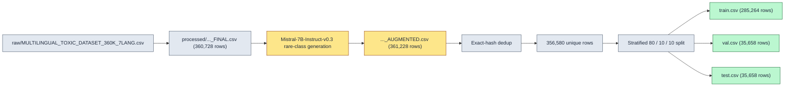

# Data

This document covers three things: what is in the corpus, where it came from, and — new on this
branch — exactly how the training loop turns the corpus into GPU batches. The first parts are
checkable against `dataset/split/stats.json`, and say so inline. The sampler and batching numbers
are measurements from profiling a real training run, not something `stats.json` records (it
describes the split files on disk, not what happens to them during training), and are cited as such.

**Multi-label, not multi-class, up front, since it changes how every number below should be read.**
In *multi-class* classification, each example gets exactly one of several mutually exclusive labels
— "this email is spam OR promotions OR primary, pick one." This dataset is *multi-label*: every
comment gets its own independent yes/no answer for all 6 labels below, so one comment can be
`toxic` + `obscene` + `insult` at the same time, or `toxic` alone, or none of the six. The labels
don't compete with each other and don't sum to 1.

## Corpus

356,580 comments across 7 languages, 6 non-exclusive binary labels, split 80 / 10 / 10:

| Split | Samples | Share |
|---|---|---|
| train | 285,264 | 80.0% |
| val | 35,658 | 10.0% |
| test | 35,658 | 10.0% |

*Verified: `dataset/split/stats.json` → `deduplication.unique_samples` = 356,580; the three split
sizes above sum to it exactly; and 356,580 × 0.8 = 285,264 while 356,580 × 0.1 = 35,658, both exact,
with nothing left over. That last check matters more than it looks — see the callout in
[Augmentation](#augmentation) about a second oversampling step that turns out not to run.*

### Language mix

The split was built with **stratified sampling**: rather than cutting the data at a random point,
the split is constructed to preserve the same proportions of language and label combination in
train, val, and test that exist in the full corpus. This matters because a plain random cut of a
corpus where `threat` is only 2% of rows risks landing a val or test set with very few — or zero —
positive `threat` examples purely by chance, making that class's metrics on that split meaningless.
Stratifying removes that risk by construction. The table below is also the evidence that it worked:
every language's share barely moves between splits.

| Language | Train | Val | Test |
|---|---|---|---|
| Russian (ru) | 41,542 (14.6%) | 5,193 (14.6%) | 5,193 (14.6%) |
| Portuguese (pt) | 41,533 (14.6%) | 5,192 (14.6%) | 5,192 (14.6%) |
| Spanish (es) | 41,346 (14.5%) | 5,168 (14.5%) | 5,168 (14.5%) |
| Turkish (tr) | 41,312 (14.5%) | 5,164 (14.5%) | 5,163 (14.5%) |
| French (fr) | 41,264 (14.5%) | 5,157 (14.5%) | 5,158 (14.5%) |
| Italian (it) | 41,165 (14.4%) | 5,146 (14.4%) | 5,146 (14.4%) |
| English (en) | 37,102 (13.0%) | 4,638 (13.0%) | 4,638 (13.0%) |

*Verified against `dataset/split/stats.json`: `{split}.lang_class_dist.{lang}.toxic.total` for the
counts, `{split}.language_dist` for the shares.*

### Class imbalance

**Class imbalance** means the thing you're predicting is not evenly split between yes and no. Here,
one label is close to a coin flip and the other five are rare — one of them very rare:

| Label | Positive rate (train, pooled across languages) | Positive count |
|---|---|---|
| toxic | 49.6% | 141,576 |
| insult | 28.6% | 81,592 |
| obscene | 24.2% | 69,001 |
| identity_hate | 5.3% | 15,048 |
| severe_toxic | 4.6% | 13,211 |
| threat | 2.1% | 6,100 |

**Why this matters:** a model can look good on accuracy for `threat` while doing nothing useful, by
predicting "no" almost every time — it would be right 97.9% of the time for free, since only 2.1% of
rows are positive. Accuracy is the wrong tool for measuring a rare class; this is why the project
reports AUC and per-class F1 instead (see [RESULTS.md](RESULTS.md)), and why the training loss
weights classes and languages rather than treating every row identically (see [MODEL.md](MODEL.md)).

*Verified against `dataset/split/stats.json` → `train.lang_class_dist`, pooled across all 7
languages. Per-language rates vary by roughly ±1-2 points around each figure above.*

## Schema

| Column | Description |
|---|---|
| `id` | Synthetic identifier: `{index}_{lang}_{labelpattern}_{hash}` |
| `comment_text` | Comment text |
| `lang` | One of `en`, `ru`, `tr`, `es`, `fr`, `it`, `pt` |
| `toxic`, `severe_toxic`, `obscene`, `threat`, `insult`, `identity_hate` | Binary labels |

Language IDs used by the model: `{en: 0, ru: 1, tr: 2, es: 3, fr: 4, it: 5, pt: 6}`
(`model/evaluation/evaluate.py:67-70`).

## Provenance

The amber step happens *before* the split. That ordering is exactly why a synthetic comment and its
near-duplicate sibling can end up on opposite sides of the train/val boundary — see
[Split hygiene](#split-hygiene) below.

**This repo does not include the script that produced the multilingual corpus** (the first arrow
above), so that step is not reproducible from here. Everything from the processed CSV onward is in
`utils/split_dataset.py` and `augmentation/`.

## Augmentation

Rare classes (notably `threat`) were topped up with synthetic samples generated by
Mistral-7B-Instruct-v0.3 in 4-bit (`augmentation/toxic_augment.py`, `augmentation/threat_augment.py`),
filtered through a lightweight sklearn validator (TF-IDF + logistic regression) and a language
check. Comparing `dataset/dataset_cards.json`'s row count for the pre-augmentation file (360,728)
against the pre-dedup row count `split_dataset.py` sees for the post-augmentation file
(`dataset/split/stats.json` → `deduplication.total_samples` = 361,228) puts this addition at roughly
500 rows overall — a small slice of the corpus, concentrated entirely in the two rarest labels.

**The labels on these rows are weak.** A label is called "weak" when it is assigned automatically or
indirectly — here, whatever class the generation prompt asked for — rather than confirmed by a
human, or some other reliable process, actually examining the output. Nobody read a generated
comment and confirmed "yes, this genuinely reads as a threat"; the label is only a record of what
Mistral was asked to produce.

**The validator that filters them is circular, which is a stronger problem than "imperfect."** It is
trained on the same labeled distribution the generator is trying to imitate, and it is then used to
filter that same generator's output. A statistical filter can only reject what looks *different* from
what it learned to call normal. If Mistral has a systematic habit when asked to write a threat — a
favorite phrase, a narrower vocabulary, a stilted sentence structure — that habit will look exactly
as toxic (or not) to the validator as the real data did, precisely because the validator's whole
notion of "what toxic text looks like" came from a population Mistral was explicitly instructed to
sound like. The validator is well-suited to catch an obviously broken generation (wrong language, no
toxic content at all) and structurally unable to catch a generation that successfully mimics the
target style while being subtly wrong in some way the surface statistics don't capture. It is an
exam graded with an answer key written by the same process being graded.

**Why this matters:** any metric computed on `threat` or `identity_hate` partly measures how well
the model learned Mistral's idea of what those look like, not only real instances of them. Read
rare-class numbers as an upper bound on real-world performance, not an estimate of it.

**A second oversampling step exists in the pipeline and does not run.**
`utils/split_dataset.py:44-80` (`oversample_rare_classes`) duplicates existing rare-class rows, with
small Gaussian noise added to the *other* label columns, aiming to top up each language to 1,000
samples per rare class (`MIN_SAMPLES_PER_CLASS`, line 23). But `split_dataset.py:191` computes
`train_idx` by running `StratifiedKFold.split` against the *original*, pre-oversampling `df`, and
`split_dataset.py:201` then uses those same positions to index the *oversampled* frame:
`df_with_oversampling.iloc[train_idx]`. The newly appended oversampled rows live at positions
`>= len(df)`; `train_idx` only ever contains positions `< len(df)`. None of the oversampled rows are
ever reachable. The exact-multiple arithmetic in [Corpus](#corpus) above (356,580 × 0.8 = 285,264,
nothing left over) is independent confirmation: there is no room in `train.csv` for extra rows from
this step. The only augmentation that actually reaches the training set is the external Mistral
generation merged in *before* this script runs.

## Split hygiene

`utils/split_dataset.py` performs the stratified split above, exact-hash deduplication *before*
splitting, distribution verification, and a contamination check. `utils/remove_leakage.py` is a
standalone re-check using the same exact-hash approach (`utils/remove_leakage.py:7-14`).

**Exact-hash dedup**, verified against `dataset/split/stats.json` → `deduplication`: 361,228 rows
in, 4,648 exact duplicates removed (1.3%), 356,580 unique rows out. **Exact `comment_text` overlap**
between every pair of splits is **0** (`contamination.exact_matches`: `train_val`, `train_test`, and
`val_test` are all `0.0`).

Exact-hash matching only catches text that is byte-for-byte identical after lowercasing and
whitespace normalization (`utils/split_dataset.py:240-246`). It does not catch **near-duplicates**:
two comments that say almost the same thing in slightly different words. Catching those needs a
similarity measure, not an equality check:

- **TF-IDF** (term frequency – inverse document frequency) turns a piece of text into a vector of
  numbers, one per possible character sequence — here, runs of 3-4 characters — where each number
  is how often that sequence appears in this text, discounted by how common the sequence is across
  all texts. A sequence every comment contains barely moves the number; a sequence that's rare
  overall but common in this one text moves it a lot. Using character sequences instead of whole
  words makes the comparison robust to small edits: swapping a synonym or fixing a typo barely
  changes which character sequences are present.
- **Cosine similarity** measures the angle between two such vectors: 1.0 means the same distinctive
  character patterns in the same proportions; 0 means unrelated. A cosine of 0.9 or higher between
  two comments means they are near-paraphrases of each other, even when no substring match would
  catch them.

Measured this way (char 3-4-gram TF-IDF, cosine ≥ 0.9 against train): **3.8%** of English val rows
and **0.6%** of Russian val rows are near-duplicates of a train row. These two figures are not in
`stats.json` — they come from a dedicated similarity pass, not the split script's own (exact-hash
only) contamination check, so they're reported here as a measurement rather than a verified-in-repo
number.

**Why it happened:** augmentation runs *before* the split (see the [pipeline](#provenance) above).
When Mistral generates several differently-worded variants from the same seed comment, those
variants are near-duplicate siblings before the split ever happens, and the split has no way to know
that two rows are siblings — so siblings can land independently on either side of the train/val
boundary purely by chance. Exact-hash dedup doesn't catch this, because siblings aren't
byte-identical, only similar. Had augmentation instead run *after* fixing which original comments
belong to which split — generating extra train-only siblings from train-only seeds only — no sibling
could ever cross the boundary, because the boundary would already exist before any sibling did.
The general lesson: anything that creates derived or duplicated rows (augmentation, oversampling, a
feature that peeks at other rows) should generally run after a split, independently within each
side of it, not before.

**Why this matters:** if a val comment is a near-paraphrase of one the model trained on, correctly
classifying it doesn't test whether the model generalizes to new toxic language — it tests whether
the model recognized something it already memorized wearing a light disguise. This is a form of
**data leakage**: information that should not cross from train into the set used to judge the model
does anyway, making the judged performance look better than true generalization would. The size of
the effect here is small (well under 4%, and only in two of seven languages), but it means English
and Russian val metrics are mildly optimistic on top of the caveats already in
[RESULTS.md](RESULTS.md#caveats).

This is one more reason the headline numbers are reported on `test` rather than `val`. `val` is
where the per-class thresholds are fitted, so it carries both this leakage and the optimism of
being the split a parameter was fitted on. `test` carries neither.

## How training reads this data

Everything above describes the CSV files sitting on disk. This section describes what changed in
how `model/train.py` turns those rows into the batches the GPU actually sees — the two largest data
correctness and performance fixes on this branch (commit `f0b0083`). Because these are properties of
a running training process rather than a static file, the numbers below come from profiling a real
run, not from `stats.json`.

### The sampler: from a random draw to one exact pass

An **epoch** is supposed to mean "one pass over the whole training set" — every row seen exactly
once before any row repeats. The pre-fix sampler did not do that. Its inner loop
(preserved in git history at `f0b0083^:model/data/sampler.py`) chose, independently for every single
slot in every batch: a language at random (weighted by that language's share of the corpus), then
one row **uniformly at random from that language's entire pool** — including rows already chosen
earlier in the same epoch. That last part is sampling **with replacement**: like dealing from a deck
that gets reshuffled and put back after every single card, so the same card can come up again before
the rest of the deck has been seen once.

Drawing `n` times with replacement from a pool of `n` items leaves any specific item undrawn with
probability `(1 - 1/n)^n`. As `n` grows this converges to `1/e`, about 36.8%, and it converges fast —
at `n` = 285,264 the exact finite value and the `1/e` limit already agree to six decimal places.
Drawing `n` items with replacement from a pool of `n` is also exactly what "bootstrap resampling"
means in statistics, and it's the same mechanism behind bagging in random forests, so this 1/e
result is worth remembering: it will reappear.

| Outcome, measured over one real epoch (n = 285,264) | 1/e prediction | Measured |
|---|---|---|
| Never drawn | ≈36.8% | 36.9% (105,125) |
| Drawn exactly once | ≈36.8% | 36.6% (104,504) |
| Drawn 2 or more times ("duplicated") | ≈26.4% | 26.5% (75,635) |

The small gaps between prediction and measurement are ordinary sampling noise, not error: across
285,264 largely-independent draws, the count of "never drawn" items has a standard deviation of
roughly 260 — about 0.1 percentage point — so a gap this size is unremarkable. One sample was drawn
8 times in this epoch; that's also unremarkable, not a fluke — the same math (formally, each item's
draw count is approximately Poisson-distributed with mean 1) predicts about 3 items reaching 8 or
more draws somewhere in a pool this size, so seeing one is right on schedule. And because each
language's slice of the draws is proportional to that language's slice of the pool, this same 1/e
logic played out *within every language separately*, not only in aggregate — stratifying by language
never protected against the replacement bug.

So in a typical old epoch: over a third of the training set was invisible to the model, on the order
of 75,000 rows were shown multiple times for no reason, and "epoch" did not mean what the word is
supposed to mean.

**Fixed** (`model/data/sampler.py`): the sampler now shuffles each language's row indices once per
epoch and hands them out **without replacement**, so every index is yielded exactly once and an
epoch is a true one-pass over the data — verified at 285,264 yielded, 285,264 unique. Reproducibility
follows the same convention as PyTorch's `DistributedSampler`: the shuffle is a pure function of
`seed + epoch` (`sampler.py:135`), so calling `set_epoch(epoch)` (`sampler.py:73-74`) before each
epoch gives a different but reproducible order.

The sampler also keeps each batch's **language mix** close to the corpus-wide mix — within 0.65
samples per batch — using the **largest remainder method** (`sampler.py:76-86`): give each language
the *floor* of its exact proportional share of the batch, then hand out whatever slots are left over
to the languages with the largest fractional remainder. (This is the same method some countries use
to allocate parliamentary seats proportionally without splitting a person across two seats.) Without
this, a model would get an uneven, noisy gradient signal for its language-specific behavior from one
training step to the next.

### Length-bucketed batching

**Padding** means adding filler tokens to the end of shorter sequences so every sequence in a batch
has the same length — a GPU processes a batch as one fixed-size tensor, so every row in it must
match the longest row. The model is configured with `max_length=512`
(`model/training_config.py:294`), and every sample used to be padded to exactly that length,
regardless of how long it actually was. Real comment lengths, in tokens (the sub-word pieces XLM-R's
tokenizer splits text into — usually shorter than a whole word, longer than a single character),
measured over the whole train split:

| Percentile | Token length |
|---|---|
| p50 (median) | 43 |
| p75 | 89 |
| p90 | 171 |
| p95 | 240 |
| p99 | 512 (the truncation cap) |
| mean | 73.4 |

Half the corpus is under 43 tokens long. Padding every sample to 512 means that for a typical
comment, roughly 9 out of every 10 tokens the model processes are pure filler that contributes
nothing to the answer — and the model pays full compute for each one anyway.

Dynamic padding — pad each batch only to its own longest member, instead of always to 512 — sounds
like it should already fix this. It's worth seeing why it doesn't before looking at the actual fix.
Measured mean padded length with random batches of 128: 498.0 tokens, a 1.03x saving over always
padding to 512. Here's the mechanism: with `p99 = 512`, at least 1% of comments sit right at the
truncation cap. The chance that a random batch of 128 comments contains *zero* of those is
`0.99^128 ≈ 27.6%` — so roughly 72.4% of random batches contain at least one near-cap comment, and
"pad to the batch's own longest member" still means padding to (near) 512 for nearly three out of
every four batches. Dynamic padding alone only helps the lucky ~27.6% of batches that happen to
dodge every long comment; the rest are just as expensive as static padding always was. This is the
counterintuitive part: the fix isn't padding *less* on average, it's controlling *which samples end
up sharing a batch* — a batch of 128 comments drawn completely at random will almost always contain
at least one long outlier, no matter how padding within that batch is handled.

**The actual fix: put similar-length samples in the same batch.** If every sample in a batch is
short, the whole batch pads to a short length; the waste above only happens when a batch mixes short
and long comments. Measured mean padded length with length-bucketed batches: 100.6 tokens — a 5.1x
reduction in padded compute versus static padding:

| Padding strategy | Mean padded length | vs. static padding |
|---|---|---|
| Static: every sample padded to `max_length` (512) | 512.0 tok | 1.00x |
| Dynamic: pad to the batch's own max, random batch contents | 498.0 tok | 1.03x |
| Length-bucketed: similar-length samples share a batch | 100.6 tok | 5.1x |

*(Measured at batch size 128 to isolate the padding question. The training config itself uses
`batch_size=64` with `grad_accum_steps=2` (`model/training_config.py:323-324`) to reach the same
effective batch of 128 while fitting in GPU memory — a separate, orthogonal concern from the padding
strategy above.)*

You cannot get the 5.1x by **sorting the whole training set by length once** and cutting it into
batches in that order — that would actively make things worse, not just be unnecessary. A global
sort makes batch content perfectly correlated with position in the epoch: the first batches would
contain only the shortest comments, the last only the longest, every single epoch. If comment length
correlates with anything about a comment's content or label — short comments tend to be terser
insults, long ones tend to be arguments or copied text — then every batch becomes a systematically
skewed, unrepresentative sample of the training distribution. Stochastic gradient descent assumes
each mini-batch is a roughly representative sample of the whole dataset; break that assumption and
the gradient computed at each step stops being a reasonable stand-in for the gradient over the whole
dataset, biasing the whole training run in a length-correlated way.

The actual scheme (`model/data/sampler.py:109-132`), redone fresh each epoch, avoids this:

1. Shuffle each language's row indices (the same shuffle the sampler above already does).
2. Cut the shuffled stream into **megabatches** of `megabatch_factor × batch_size` rows (factor 20,
   so 2,560 rows at batch size 128 — small enough to be a local window, large enough that it is
   still a representative random sample of the whole corpus, not a length-sorted slice of it).
3. Sort **within each megabatch only**, separately per language (a *stable* sort, so length ties —
   common, since lengths cluster — keep the random order from step 1, breaking ties randomly rather
   than by the original row order in the CSV).
4. Slice each sorted megabatch into batches of `batch_size`, giving each language its proportional
   share of every batch (the same largest-remainder method used for the language mix above).
   Consecutive batches drawn from one megabatch get progressively longer, but every individual batch
   is still a same-length group.
5. Shuffle the **order of the resulting batches** before handing them to the training loop, so the
   model doesn't process every short batch before every long one within an epoch.

Because the sort only ever happens inside a small, randomly-chosen window, a batch's *position in
the epoch* tells you nothing about its length, and the language mix is undisturbed — only *which*
samples end up sharing a batch changes. Homogeneity is local; representativeness stays global.

**Getting the lengths cheaply enough to do this matters too.** Sorting by length needs a length for
every one of 285,264 rows *before* training starts. Running the real tokenizer once, in a single
batched call to a fast, Rust-backed tokenizer, takes about 42 seconds for the whole train split
(`model/evaluation/evaluate.py:129-190`, the `token_lengths` property) and is then cached to disk
under `cache/`, keyed by row count, `max_length`, tokenizer name, and a hash of the text column
(`evaluate.py:156-158`) — so a change to the data or the config invalidates the cache automatically.
The one gap: the cache key does not cover a tokenizer that mutates in place after being loaded, so
that specific edge case would need the cached `.npy` file deleted by hand. A cheaper proxy — counting
characters instead of running the tokenizer — was also tried, and reached only 4.0x versus the 5.1x
above, because character count and token count don't track each other closely enough: tokenization
is not one-token-per-character, and how far off that approximation runs varies by language and by
how much punctuation or repeated characters a comment has. 42 seconds, paid once per dataset, buys a
meaningfully better bucketing than the free proxy.

The net effect on training speed: roughly 55.5 minutes per epoch before this fix (on a run that, per
the section above, never actually completed a true pass over the data) versus 35.4 minutes per
epoch after, including a full validation pass. Length-bucketing is the largest single contributor to
that difference.

---

Related reading: architecture and the training configuration are in [MODEL.md](MODEL.md); metrics
and their caveats are in [RESULTS.md](RESULTS.md); the fuller catalog of correctness bugs, including
ones outside the data pipeline, is in [KNOWN_ISSUES.md](KNOWN_ISSUES.md).
