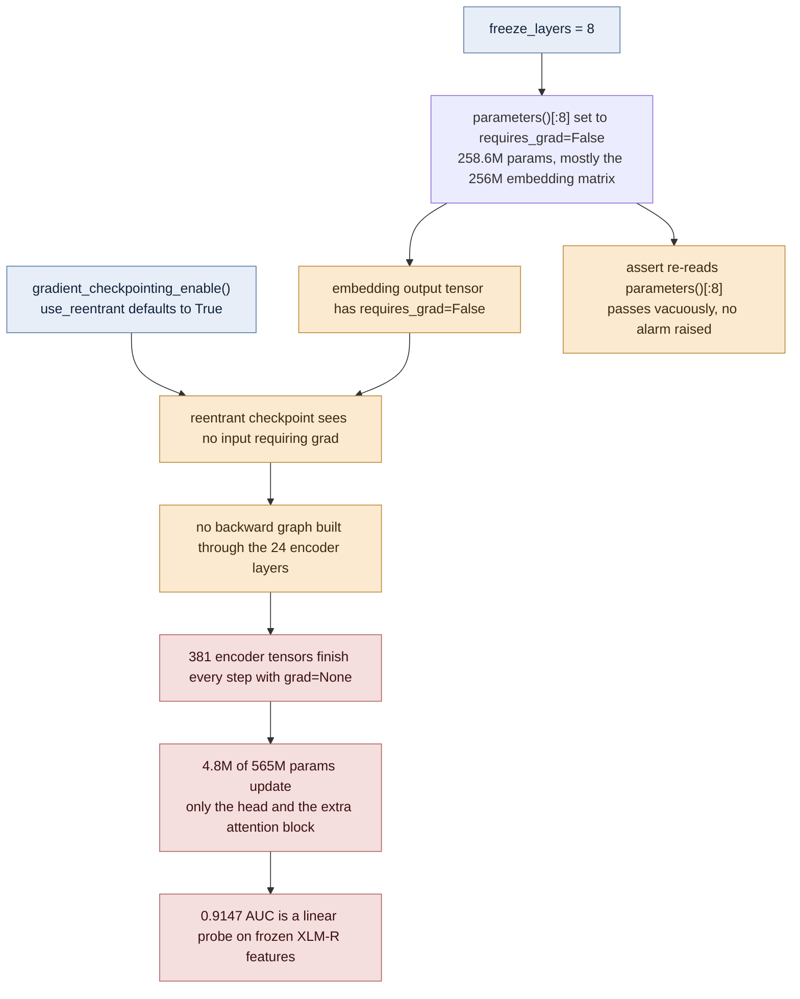
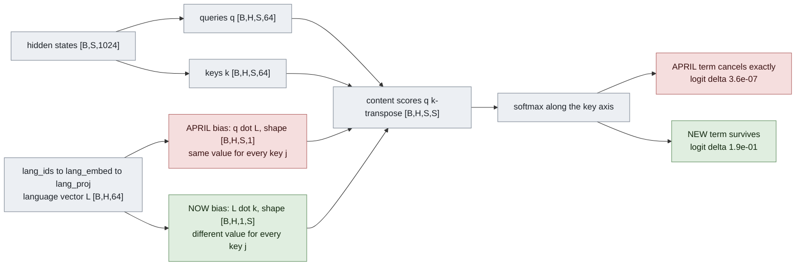

# Known issues: a post-mortem

An earlier version of this file listed eleven bugs found by auditing the April 2025 code after
the fact, and said none were fixed. That is no longer true, and it was not entirely accurate
when it was written.

This version is a post-mortem. It covers three things:

1. **Fixed** — each of the original eleven, what the bug actually was, how it was fixed, and the
   measurement that proves it. Five of the original diagnoses (issues 1, 3, 4, 6 and 11) were
   wrong or incomplete; those are called out.
2. **Found during the fix** — five bugs the original audit missed completely. One of them killed
   the April training run.
3. **Still open** — what is still broken, how bad it is, and whether it touches any reported
   number.

Work is on branch `fix/training-correctness`, commit `f0b0083`. **A training run is in progress.
Final results do not exist yet, and nothing in this document reports them.** Where numbers appear
they are either the April baseline (test split) or epoch 1 of the new run (validation split),
always labelled.

## How to read this

The section headings in Part 1 keep the original audit's exact wording, so older links still
resolve. The heading is the original claim; the body says what was really going on.

Every claim carries a `file:line` reference. If something here looks wrong, open the file and
check. Line numbers without a prefix are current code. Line numbers prefixed `3d876a4:` are the
April version — the last commit before the fix — readable with
`git show 3d876a4:model/train.py` and similar.

## Terms used here

Defined once, in the order you will meet them. Each one gets a fuller treatment where it does
real work.

| Term | One-sentence meaning |
| --- | --- |
| Freezing | Setting `requires_grad = False` on a parameter so the optimizer never updates it. |
| Gradient checkpointing | Throwing away intermediate activations during the forward pass and recomputing them during the backward pass, trading compute for memory. |
| Reentrant / non-reentrant | Two implementations of checkpointing in PyTorch; the older reentrant one silently builds no backward graph if none of its inputs require gradients. |
| Queries, keys, values (q, k, v) | Three linear projections of the same input; attention scores each query against every key, then mixes the values by the resulting weights. |
| Softmax | Turns a row of scores into probabilities that sum to 1, via `exp(score) / sum of exp(scores)`. |
| Mixed precision (AMP) | Running most of the forward and backward pass in 16-bit floats for speed and memory, keeping a 32-bit copy of the weights. |
| Loss scaling | Multiplying the loss by a large constant before backprop so small 16-bit gradients do not flush to zero; the scaler divides it back out before the optimizer step. |
| Gradient clipping | Rescaling the whole gradient vector down if its norm exceeds `max_grad_norm`, so one bad batch cannot take a huge step. |
| Warmup | Ramping the learning rate up from 0 over the first few percent of steps, instead of starting at full rate on a randomly initialised head. |
| Focal loss | Binary cross-entropy reweighted so that already-easy examples contribute less; `gamma` controls how sharply, `alpha` reweights positive against negative. |
| AUC | Probability that a random positive scores above a random negative. Threshold-free, so it measures ranking quality only. |
| F1 | Harmonic mean of precision and recall at one chosen threshold. Unlike AUC it depends on where you put the cut. |
| Macro vs weighted average | Macro averages the six per-class scores equally, so rare classes count as much as `toxic`; weighted averages by class frequency, so `toxic` dominates. |

## Status at a glance

| Issue | Ref | Verdict on the original diagnosis | Status | Touched published numbers |
| --- | --- | --- | --- | --- |
| The language-aware attention is a no-op | 1 | Bug correct, **suggested fix also broken** | Fixed | Yes — the project's premise was inert |
| No validation loop | 2 | Correct | Fixed | Yes — checkpoint chosen by hand |
| Class weighting never runs | 3 | Correct, but **only the first of four faults** | Fixed | Yes — rare-class recall |
| `freeze_layers` does not freeze layers | 4 | **Badly understated** — it stopped the whole encoder training | Fixed | Yes — invalidates the interpretation |
| No learning-rate warmup | 5 | Correct | Fixed | Yes, indirectly |
| Hardcoded per-language tables | 6 | Copy-paste correct, **"dead code" wrong** — live in serving | Fixed | Yes, on the serving path |
| Train/eval sequence-length mismatch | 7 | Correct | Fixed | Yes |
| `label_smoothing` is unused | 8 | Correct | Fixed | No |
| Redundant loss computation | 9 | Correct | Fixed | No |
| `CUDA_LAUNCH_BLOCKING` left enabled | 10 | Correct | Fixed | No — speed only |
| Training did not finish | 11 | Symptom correct, **cause wrong** | Fixed | Yes |
| AMP scaler deadlock | A | Missed entirely | Fixed | Yes — it ended the April run |
| Sampler drew with replacement | B | Missed entirely | Fixed | Yes — 36.9% of data unseen per epoch |
| Three more class-weighting faults | C | Missed entirely | Fixed | Yes |
| Second GPU never used | D | Missed entirely | Fixed | No — speed only |
| Serving truncated at 128 tokens | E | Missed entirely | Fixed | Serving only, 15.68% of comments |
| Per-language threshold MRO bug | O1 | New | **Open** | No — dead code |
| `best_score_` mislabelled | O2 | New | **Open** | Reported F1 only |
| `--dynamic_padding` crashes | O3 | New | **Open** | No |
| `roc_auc_score` returns NaN | O4 | New | **Open** | Only on degenerate classes |
| Token-length cache key | O5 | New | **Open** | No |
| `optuna` undeclared | O6 | New | **Open** | No |
| The ablation has not been run | O7 | Carried over | **Open** | The central claim is still untested |
| `class_adjustments` is fabricated and now live | O8 | Half of issue 6 | **Open** | Will affect the run in progress |

---

# The headline finding: the encoder never trained

This is the single most important thing in the repository, and the original audit reduced it to
a naming complaint (issue #4: "`freeze_layers` does not freeze layers"). The reality is worse.
**The April 2025 model never fine-tuned XLM-RoBERTa at all.** 4.8M of 565M parameters — 0.8% —
actually received a gradient. All 381 tensors in the encoder finished every backward pass with
`grad = None`.

Two individually defensible decisions multiplied into this. Neither is a bug on its own. Keep
them separate in your head, because the doc that conflates them gets the wrong lesson.

## Part one: freezing the embeddings is a good idea

Freezing a parameter means setting `requires_grad = False` so the optimizer skips it. XLM-R
large's word-embedding matrix is a lookup table with one 1024-dimensional row per vocabulary
entry:

```
250,002 vocabulary entries x 1,024 dimensions = 256,002,048 parameters
```

That is 256M of the 565M-parameter model — 46% of it, in one tensor. Two reasons to freeze it:

- Those embeddings come out of XLM-R's multilingual pretraining already well fitted to a hundred
  languages. A six-epoch run on 285k comments is not going to improve them, and is quite likely
  to damage the languages that appear rarely in this dataset.
- AdamW keeps two extra state tensors per parameter (a running mean and a running variance).
  Training the embeddings means carrying 768M floats of optimizer state for that one matrix and
  writing all of it on every single step. Freezing it is the largest cheap saving available.

So freezing the embeddings is deliberate, it was kept in the fix, and the new run still freezes
them. It trains 307.1M parameters — 54.4% of the model — which is the encoder layers, the extra
attention block, and the classifier head.

**The bug was never the freezing.** The bug is what freezing silently did next.

## Part two: what gradient checkpointing is, and what "reentrant" means

A transformer's backward pass needs the activations computed during the forward pass. Storing
all of them for 24 layers at batch 128 and 512 tokens does not fit in 24 GB. Gradient
checkpointing solves this by *not* storing them: it saves only the input to each checkpointed
block, and recomputes the block's internals during backprop. You pay roughly one extra forward
pass for a large memory saving.

PyTorch has two implementations. The older one, selected by `use_reentrant=True`, is the
**default** for `gradient_checkpointing_enable()`. It works by re-running the block inside a
custom autograd function. Critically, it decides whether to build a backward graph by looking at
whether any *input tensor* to the checkpointed segment requires grad. It does not look at the
parameters inside the block.

That rule is where this failed.

## Part three: how the two combined

The April code did this (`3d876a4:model/train.py:115-116`):

```python
if config.freeze_layers > 0:
    for param in list(_model.base_model.parameters())[:8]:
        param.requires_grad = False
```

`freeze_layers` was set to 8 (`3d876a4:model/training_config.py:283`) and the intent was clearly "freeze the first 8 transformer layers". But `base_model.parameters()` is a flat list
of tensors in registration order, not a list of layers. The first 8 entries are the embedding
tensors plus part of layer 0 — 258.6M parameters, 46.2% of the base model, almost all of it the
word-embedding matrix.

Freezing the embeddings makes the embedding output a tensor with `requires_grad = False`. That
tensor is the input to the checkpointed encoder. Reentrant checkpointing saw an input that did
not require grad, concluded there was nothing to differentiate, and built no backward graph
through any of the 24 layers.



Two ordinary decisions — freeze a big embedding matrix, turn on checkpointing to fit in memory —
combined into a model whose backbone could not learn.

## The assertion that should have caught it

The line immediately after the freeze (`3d876a4:model/train.py:119`) was:

```python
assert not any([p.requires_grad for p in _model.base_model.parameters()][:8]), \
    "First 8 layers should be frozen"
```

It re-reads the same wrong slice it just wrote. Of course the first 8 tensors are frozen: the
loop above froze exactly those 8 tensors. The assertion can never fail, whatever `freeze_layers`
is set to, and it tells you nothing about layers. `TrainingConfig.validate_model_config`, which
checks correctly against `encoder.layer`, was never called.

A check that cannot fail is worse than no check, because it buys false confidence.

## Measurements

Cost of building a correct backward graph, batch 128, fp16, RTX 6000:

| Checkpointing mode | Seconds per batch | Peak memory | Encoder gradients |
| --- | --- | --- | --- |
| `use_reentrant=True` (April default) | 0.218 | 3.58 GB | **all `None`** |
| `use_reentrant=False` (now) | 0.867 | 7.33 GB | correct |

Real training is 4.0x slower and needs 2.05x the memory. That gap is the work the April run was
not doing.

Parameters actually receiving gradient:

| Run | Trainable | Share of 565M |
| --- | --- | --- |
| April 2025 | 4.8M | 0.8% |
| `fix/training-correctness` | 307.1M | 54.4% |

## What this means in practice

The published 0.9147 macro AUC is not wrong as a number. It is a correct measurement of
something other than what everybody assumed it measured: a small classifier head trained on top
of **frozen, general-purpose** XLM-R features. That is a linear probe, and 0.9147 is a
respectable linear-probe score. It is not a fine-tuned XLM-R-large.

Every claim in the old results that compares this architecture against anything, or attributes
performance to the language-aware design, has to be re-read with that in mind.

The fix is at `model/train.py:251-259` (freeze by module name, with `freeze_embeddings` as its
own flag), `model/train.py:279` (call the real validator), and `model/train.py:284-292` (request
`use_reentrant=False`, falling back cleanly on older transformers).

---

# Part 1 — Fixed

Headings keep the original audit's wording so older links still resolve.

## 1. The language-aware attention is a no-op

**The original diagnosis was right. The fix it proposed was broken in exactly the same way.**
That is worth dwelling on, because the reason it is broken is the whole lesson.

### The mechanism first

Self-attention projects the same hidden states three ways: **queries** `q`, **keys** `k`, and
**values** `v`. For each query position `i` it scores every key position `j` with a dot product
`q_i · k_j`, softmaxes those scores across `j`, and uses the result as mixing weights over the
values. In this model `hidden_size = 1024` over `16` heads, so each head works in `head_dim = 64`
dimensions.

Softmax over the key axis is:

```
softmax(s)_j = exp(s_j) / sum over m of exp(s_m)
```

Now add a constant `c` — the same value for every `j`:

```
exp(s_j + c) = exp(s_j) * exp(c)
```

`exp(c)` appears once in the numerator and once in every term of the denominator, so it factors
straight out and cancels:

```
softmax(s + c) = softmax(s)
```

This is **softmax shift-invariance**. Adding the same number to every score in a row changes
nothing at all. (This is not an approximation and not a numerical detail. It is exact, and it is
the same property that lets numerically-stable softmax implementations subtract the row max for
free.)

### The bug

The April code (`3d876a4:model/language_aware_transformer.py:296-298`):

```python
attn_bias = lang_bias.view(batch_size, num_heads, head_dim, 1)
attn_scores = torch.matmul(q, k.transpose(-2, -1)) * self.scale
attn_scores = attn_scores + torch.matmul(q, attn_bias).squeeze(-1).unsqueeze(-1)
```

`torch.matmul(q, attn_bias)` contracts `q` of shape `[B, H, S, 64]` against a language vector of
shape `[B, H, 64, 1]`, giving `[B, H, S, 1]`. That is one number per query position `i` — call it
`q_i · L`. It gets broadcast across the key axis when added to scores of shape `[B, H, S, S]`.

So for a fixed query `i`, the bias is the same number for every key `j`. By shift-invariance it
cancels exactly. The language identity had **literally zero** effect on the model's output.

| Shape | Constant along | Survives softmax over keys? |
| --- | --- | --- |
| `[B, H, S, 1]` (April) | the key axis | **No** — cancels exactly |
| `[B, H, 1, S]` (now) | the query axis | **Yes** |

### Why "or add it to keys" was also wrong

The old version of this file suggested: *"Reshape the language bias to `[B, H, 1, S]`, or add it
to keys rather than to post-softmax scores."*

The second half is broken. Adding a language vector `L` to every key gives:

```
q_i · (k_j + L) = q_i · k_j + q_i · L
```

The extra term is `q_i · L`. It depends only on `i`. It is constant along `j`. It cancels under
softmax for exactly the same reason the original bug did. The audit correctly identified a bug
and then proposed a fix with the identical flaw — which is a good illustration of how easy this
particular mistake is to make twice.

The term has to be added to the **queries**:

```
(q_i + L) · k_j = q_i · k_j + L · k_j
```

Now the extra term is `L · k_j`. It varies with `j`. It survives.



The language signal enters at the same place in both versions. Only the axis it varies along
decides whether softmax keeps it.

### The fix and the measurement

`model/language_aware_transformer.py:246-255`:

```python
lang_emb = self.lang_embed(lang_ids)                  # [B, 64]
lang_vec = self.lang_proj(lang_emb).view(batch_size, num_heads, 1, head_dim)
attn_scores = attn_scores + torch.matmul(lang_vec, k.transpose(-2, -1)) * self.scale
```

`lang_proj` ends in `Tanh`, so the offset is bounded, and it is scaled by `self.scale` to stay in
the same units as the content scores.

Verification: feed the same text with two different `lang_ids` and measure how far the output
logits move.

| Version | Logit delta between two languages |
| --- | --- |
| April | 3.6e-07 |
| Now | 1.9e-01 |

3.6e-07 is float32 rounding noise, not a signal.

**A trap worth knowing about.** The old code leaks about 4e-08 of that noise back into
`lang_embed`, so a naive "is the gradient non-zero?" test **passes on the broken model**. If you
test this kind of thing, test the magnitude, not the mere existence of a gradient.

`LanguageAwareClassifier`, which concatenated language embeddings correctly but was never
instantiated, has been deleted rather than left as a decoy.

**What this means in practice.** For the whole April run, `lang_ids` was a variable that got
computed, passed around, and ignored. What actually trained was a language-agnostic model.

## 2. No validation loop

`create_dataloaders` was called with `val_dataset=None` and ignored it. `MetricsTracker.best_auc`
stayed `0.0` for the entire run. There was no model selection, no early stopping, no in-training
metric of any kind — checkpoints were written every epoch and one was picked by hand afterwards.

Fixed: `validate()` at `model/train.py:558` runs a full pass over the validation split each epoch
and computes AUC **once over the concatenated split**, not per batch. That detail matters: a
single batch often contains only one label value for a rare class like `threat`, and
`roc_auc_score` raises on that. Classes that are degenerate over the whole split are skipped with
a warning and left out of the macro average, rather than silently scored as 0.

Validation loss uses fixed `alpha`/`gamma` rather than the training weights, because the training
weights are derived from running batch statistics — scoring with them would move the target
between epochs and let validation data pollute those statistics.

Model selection now writes the best checkpoint to a fixed `best_model/` path
(`model/train.py:748`), outside the keep-last-3 rotation so it can never be deleted, and swaps it
into place atomically via a staging directory and `os.replace`. Overwriting 2.15 GB in place
leaves a roughly 5-second window in which a crash destroys the only checkpoint that matters.

## 3. Class weighting never runs

Correct, and it was the shallowest of four faults stacked on top of each other.
`config.lang_weights` was never set, so the guard at `3d876a4:model/train.py:235` always fell
through to uniform focal parameters (`alpha=0.25`, `gamma=2.0`). All of `weights/language_class_weights.json`
and `analysis/compute_class_weights.py` was dead weight at train time.

`use_class_weights` now defaults to `True` (`model/training_config.py:355`) and
`DynamicClassWeights` is constructed at `model/training_config.py:471`. The other three faults
are in [Part 2, item C](#c-class-weighting-had-three-more-faults-underneath) — fixing this one
just exposed them.

## 4. `freeze_layers` does not freeze layers

See [The headline finding](#the-headline-finding-the-encoder-never-trained). The original
description of this as a naming problem understates it by about two orders of magnitude.

## 5. No learning-rate warmup

Warmup ramps the learning rate up from 0 over the first few percent of steps. It exists because
at step 0 the classifier head is randomly initialised: its gradients are large and point in an
arbitrary direction, and taking a full-size step on them can shove the pretrained encoder
somewhere it will not recover from.

`warmup_steps` was computed at `3d876a4:model/train.py:443`, logged, and then never used. The
scheduler was a bare `CosineAnnealingWarmRestarts`, despite `warmup_ratio=0.1` sitting in the config.
Worse, restarts periodically throw the learning rate back up to full — the opposite of what a
short fine-tuning run wants.

Fixed at `model/train.py:790-819`: linear warmup from 0 to 2e-5 over 10% of total optimizer
steps, then a single half-cosine decay to `lr * 0.01`. `use_warmup` at
`model/training_config.py:356` allows the old behaviour for comparison. The schedule is logged
explicitly at run start so it can be checked rather than assumed.

One related fault, not in the original list: the scheduler used to step once per epoch in one
path and once per batch in another. It now steps exactly once per successful optimizer step
(`model/train.py:535-537`), and is skipped when AMP skips the step.

## 6. Hardcoded "per-language" tables are copy-paste

**The copy-paste finding was right. The "dead code" finding was wrong, and that matters.**

The tables are indeed fake. All six non-English rows of `LANG_THRESHOLD_ADJUSTMENTS` were byte
identical — `[-0.02, 0.00, 0.02, 0.00, -0.03, 0.00]` for Russian, Turkish, Spanish, French,
Italian and Portuguese alike — under comments claiming language-specific derivations. Nobody
derives the same six numbers from six different languages.

The original audit then said: *"Both blocks are dead in any case: the threshold block only fires
under `mode='inference'`, which neither `train.py` nor `evaluate.py` passes."*

`model/inference_optimized.py:142` passes `mode='inference'`. It always did. The block was live
on the **serving path** — the path that answers real user requests — while being absent from
training and evaluation. So the deployed model was quietly applying invented per-language logit
offsets that no evaluation ever measured, and every published metric described a different
decision rule from the one users were getting.

Fixed: `LANG_THRESHOLD_ADJUSTMENTS` is deleted (`model/language_aware_transformer.py:278` is now
just the sigmoid). `mode` is retained as an accepted-and-ignored argument, with a comment saying
why, so the existing serving call does not break.

**The second table is not fixed, and is now worse.** `class_adjustments`
(`model/training_config.py:122-130`) has the same problem: five of its six non-English rows are
byte identical, `tr` differs in one position, and the comments contradict the values (`ru` is
annotated "Russian has more insults" and then multiplies the insult weight by 0.9, downward).
Until this branch it was harmless because class weighting never ran. Now that
[issue #3](#3-class-weighting-never-runs) is fixed, this table multiplies every per-language
class weight on every batch. It is carried as [O8](#o8-class_adjustments-is-fabricated-and-now-live).

**What this means in practice.** "Nothing calls it" is a claim about the whole repository, and
this one was checked against two files out of the three that matter. Serving code is easy to
forget — and fixing a dormant bug can wake a second one sleeping next to it.

## 7. Train/eval sequence-length mismatch

Training used `max_length=512`; `evaluate.py` defaulted to `128`
(`3d876a4:model/evaluation/evaluate.py:658`). Any comment longer than 128
tokens was silently truncated at evaluation time but not at training time, so the model was
scored on inputs shorter than the ones it learned from.

`evaluate.py`'s `--max_length` now defaults to 512 (`model/evaluation/evaluate.py:920`) with a
help string that says it must match training. See [item E](#e-serving-truncated-at-128-tokens)
for the same bug in a worse place.

## 8. `label_smoothing` is unused

`label_smoothing=0.01` sat in the config, referenced by no loss function. Label smoothing nudges
hard targets of 0 and 1 slightly inward (to `eps/2` and `1 - eps/2`), which stops the model
driving logits to infinity to chase a target it can never reach.

Now implemented in `LanguageAwareFocalLoss` (`model/train.py:350`, applied at `:385-386`) and
passed from config at `model/train.py:573` and `:856`. The focal modulation still keys off the
hard label, so at `label_smoothing=0` the loss is bit-identical to before — the setting is opt-in
and does not silently change existing behaviour.

## 9. Redundant loss computation

The model computed a `WeightedBCEWithLogitsLoss` inside `forward()` whenever labels were passed,
which `train.py` then immediately overwrote with the focal loss. Every training step paid for a
loss nobody read.

Loss is now opt-in via a `compute_loss` flag, defaulting to `False`
(`model/language_aware_transformer.py:287-289`), and `train.py` no longer passes `labels` to the
model at all.

## 10. `CUDA_LAUNCH_BLOCKING` left enabled

Set unconditionally at `3d876a4:model/train.py:623`. It makes every CUDA kernel launch
synchronous, which
is useful for getting accurate stack traces when debugging and useless otherwise.

Measured cost: **31 ms per batch, 3.7% of step time.**

Removed at `model/train.py:1271-1276`. The other half of the same debugging setup —
`cudnn.deterministic = True` with `benchmark = False` — went with it, since run-to-run ordering
is now reproducible through the sampler seed instead.

## 11. Training did not finish

The symptom was right: the config asks for 6 epochs and the evaluated checkpoint is epoch 2.
**The cause given was wrong.**

The old text blamed a wandb auth error in `logs/train_20250401_143955.log`. What the logs
actually show:

| Time (2025-04-01) | Event | Evidence |
| --- | --- | --- |
| 12:28:07 | Epoch 1 completed, loss 0.0169 | `logs/train_20250401_113142.log:2267` |
| 13:23:37 | Epoch 2 completed, loss 0.0145 | `:4510` |
| 14:19:08 | Epoch 3 completed, loss 0.0141 | `:6753` |
| 14:24:32 | Epoch 4, batch 210: gradient norm `inf`, optimizer step skipped | `:6978` |
| 14:24:33 | Batch 211 raises `unscale_() has already been called` | `:6980` |
| 14:24:33 – 14:32:09 | Batches 211-551: **341 consecutive batches, every one a no-op** | `:6980-9360` |
| 14:32:09 | Log ends mid-epoch-4 | end of file |
| 14:42:25 | Restart attempt dies on a wandb API key error | `logs/train_20250401_143955.log:1` |
| 14:42:39 | Second restart dies on `TypeError: unexpected keyword argument 'num_workers'` | `logs/train_20250401_144235.log:3` |

So: the run was killed by the AMP scaler deadlock described in
[item A](#a-the-amp-scaler-deadlock), spent its last eight minutes doing nothing at all, and the
wandb auth failure is what stopped the *restart*, not the run. Three epochs completed, at 55.5
minutes each.

Two fixes:

- The logging backend can no longer take a run down. wandb is replaced by
  `model/tracking.py` — TensorBoard plus MLflow behind one interface, each with its own failure
  counter, self-disabling after repeated errors. Every public method including `__init__` and
  `close()` is exception-proof. If mlflow is not installed it degrades to plain TensorBoard with
  one log line.
- Checkpoint rotation sorted directories **by name** and kept the last 3. A new run writing into
  the same directory would therefore have deleted the 2025 checkpoints at epoch 4. New runs write
  to `weights/toxic_classifier_xlmr_v2` (`model/training_config.py:316`), and the best checkpoint
  lives outside the rotation entirely.

New run: **35.4 minutes per epoch**, including a full validation pass that the April run did not
do at all.

## Also fixed: the threshold-tuning protocol

Not one of the eleven, but item 3 on the old closing checklist. April tuned per-class decision
thresholds on the same split it then reported metrics from. Tuning and reporting on the same data
means the reported F1 is optimistically biased — you are quoting the best of 50 thresholds
measured on the data you chose it from.

`evaluate.py` now freezes thresholds on `--val_file` and reports on `--test_file`
(`model/evaluation/evaluate.py:1011`). `--single_split_eval` reproduces the old protocol for
comparison.

**Honest footnote:** switching protocols moved the numbers by less than 0.003. The old protocol
was wrong in principle, and nobody was materially misled by it. Both things are true.

---

# Part 2 — Found during the fix

Five bugs the original audit did not find. The first one ended the April run.

## A. The AMP scaler deadlock

Mixed precision keeps activations in 16-bit floats, whose smallest representable magnitude is far
above float32's. Small gradients would flush to zero, so `GradScaler` multiplies the loss by a
large constant before backprop and divides it back out (`unscale_`) before the optimizer step. If
the scale is too large the gradients overflow to `inf`, and the scaler is supposed to skip that
step, halve the scale, and carry on. **Overflowing in the first few steps is normal and expected**
— it is how the scaler finds the right scale.

The April code (`3d876a4:model/train.py:300-308`) handled the overflow like this:

```python
scaler.unscale_(optimizer)
grad_norm = torch.nn.utils.clip_grad_norm_(model.parameters(), config.max_grad_norm)
if grad_norm.isnan() or grad_norm.isinf():
    logger.warning(f"Gradient norm is {grad_norm}, skipping optimizer step")
    optimizer.zero_grad()
    return loss.item() * config.grad_accum_steps    # <-- returns before scaler.update()
```

`GradScaler` is a small state machine. `unscale_()` moves it into an "already unscaled" state,
and only `update()` moves it back. Returning early skips `update()`, so the scaler is stuck.
Every subsequent step's `unscale_()` raises `RuntimeError: unscale_() has already been called on
this optimizer since the last update()`.

That exception was then caught by a bare `except Exception` in the batch loop
(`3d876a4:model/train.py:553`), which logged the batch shapes and did `continue`.

The result is a training loop that looks completely healthy — the progress bar advances, batches
are consumed, the loss is printed — and updates nothing, forever.

**This is not hypothetical, and it is not a maybe.**

| Evidence | What it shows |
| --- | --- |
| `logs/train_20250401_113142.log:6978-9360` | The April run hit it at epoch 4 batch 210 and ran 341 dead batches before the process ended. |
| `logs/train_20260830_012634.log:54-56` | Reproduction at batch 8 / seq 128: `inf` fires at **batch 0**, deadlock from batch 1. |
| Direct measurement | After the skip, **zero parameters changed over the next 20 batches.** |

Because the first overflow can fire at step 0, a run that tripped this one step earlier would
have trained nothing at all and still reported a smoothly decreasing loss curve.

**The fix** (`model/train.py:521-543`): there is no separate skip path, because there does not
need to be one. `scaler.step()` is *already* a no-op when the unscale found non-finite gradients.
The correct code just always calls `step()` then `update()`, and detects whether the step
happened by comparing the loss scale before and after:

```python
scale_before = scaler.get_scale()
scaler.step(optimizer)
scaler.update()
stepped = scaler.get_scale() >= scale_before
```

The scheduler advances only when `stepped` is true, so skipped steps no longer burn learning-rate
schedule. Skips are logged at debug level with both scale values.

**What this means in practice.** The most dangerous class of training bug is the one that leaves
every visible indicator looking normal. A loss curve is not evidence that weights are changing;
only a parameter delta is.

## B. The sampler drew with replacement

`MultilabelStratifiedSampler` built each batch like this
(`3d876a4:model/data/sampler.py:48-49`):

```python
group = np.random.choice(self.valid_groups, p=self.group_probs)
idx = np.random.choice(self.group_indices[group])
```

`np.random.choice` samples **with replacement** by default. Each index was drawn independently,
so "one epoch" was not a pass over the dataset — it was `n` independent draws from it. It also
computed `num_batches = num_samples // batch_size`, silently discarding the remainder.

Measured on the real 285,264-row training split, one epoch:

| Quantity | Value | Share |
| --- | --- | --- |
| Unique samples seen | 180,139 | 63.1% |
| **Never seen at all** | **105,125** | **36.9%** |
| Seen more than once | 75,635 | — |
| Most repeats of a single sample | 8 | — |

Over six epochs the effect partly washes out, but "epoch" stopped meaning what it says, and any
per-epoch comparison was noisier than it looked.

**The fix** (`model/data/sampler.py`): an exact one-pass sampler. Each group's indices are
shuffled, then batches are filled by giving every language its proportional share using the
largest-remainder method. Verified: 285,264 yielded, 285,264 unique, per-batch language mix
within **0.65 samples per batch** of the global mix. Ordering is a pure function of
`seed + epoch` via `set_epoch()`, following the `DistributedSampler` convention, so a run is
reproducible.

The same rewrite added optional length bucketing, which is where the throughput came from:

| Batching strategy | Mean padded tokens per batch | Speedup |
| --- | --- | --- |
| Pad every sample to 512 | 512.0 | 1.00x |
| Dynamic padding, random order | 498.0 | 1.03x |
| Length-bucketed, megabatch 20x | 100.6 | **5.1x** |

Token lengths on this split are p50 43, p75 89, p90 171, p95 240, p99 512, mean 73.4. Dynamic
padding **alone is worth nothing** at batch 128, because with 128 random comments per batch you
almost always catch at least one 512-token comment and pad everything up to it anyway. The
bucketing is the entire win.

## C. Class weighting had three more faults underneath

Setting `config.lang_weights` (issue #3) only revealed that `DynamicClassWeights` had never
actually run, and could not have.

| Fault | Where | Effect |
| --- | --- | --- |
| Integer language ids passed where string codes were expected | `3d876a4:model/train.py:236-240` sent `lang.item()`; `running_stats` is keyed `'en'`, `'ru'`, ... | `if lang not in self.running_stats: continue` — every sample silently skipped |
| Running stats on CPU, batch labels on CUDA | `3d876a4:model/training_config.py:58` and `:65` | Device mismatch raised on **every** batch, caught by the fallback `except`, uniform weights returned |
| `alpha`/`gamma` accumulated per sample instead of per language | `3d876a4:model/training_config.py:140-149` | Each language contributed `n` times with weight `n/batch_size`, so `n²/batch_size` instead of `n/batch_size` |

The third one is the interesting one. With ~7 languages roughly evenly represented in a batch of
128, each contributes about 18 samples, so every contribution was inflated by roughly **18x**.
Both `alpha` and `gamma` then hit their clamp ceilings on every single batch — the "dynamic"
weighting produced the same saturated constant every time.

Fixes: `batch_lang_codes()` at `model/train.py:414` maps ids to codes; batch counts are moved to
CPU before the EMA update (`model/training_config.py:65-70`); accumulation is a proper
frequency-weighted mixture whose weights sum to 1 (`model/training_config.py:166-172`).

Verified active and non-uniform: weights min **0.41**, max **1.42**, mean **1.00**; rare classes
receive about **2.6x** the weight of `toxic`.

### A second-order fault: alpha was silently defeating gradient clipping

`alpha` unnormalized averages about 4, which scales the whole loss and therefore the whole
gradient. Measured true gradient norms ran **53-61** against `max_grad_norm = 1.0`.

Gradient clipping rescales the gradient if its norm exceeds the limit. It is meant to be an
outlier guard that fires rarely. At a 55x overshoot it fires on **every step**, which means the
optimizer is no longer taking a step proportional to the gradient — it is taking a fixed-size
step in the gradient's direction, every time. The learning rate stops meaning anything.

Fix (`model/training_config.py:177-185`): normalize `alpha` to mean 1.0 after clamping. The
relative per-class weighting is what carries information; the absolute scale only inflates the
norm. Observed gradient norm after the fix: **median 0.96**. Clipping is an outlier guard again,
and train and validation losses are on the same scale, so they can be compared.

## D. The second GPU was never used

`train.sh` has always exported `CUDA_VISIBLE_DEVICES="0,1"` and the docs claimed 2x GPU. Nothing
in the code ever wrapped the model for multi-GPU. The second Quadro RTX 6000 sat idle for the
entire April run.

`init_model` now wraps in `DataParallel` only when `config.data_parallel` is set **and** more
than one CUDA device is actually visible, and logs plainly when it declines
(`model/train.py:298-306`).

The honest conclusion, recorded so nobody re-litigates it: the current run stays single-GPU on
purpose. `DataParallel` puts all optimizer state on device 0, producing a 3.8x memory imbalance,
and buys nothing at this scale. The path exists and is correct; it is not used.

## E. Serving truncated at 128 tokens

Issue #7 covers `evaluate.py`. The same 128 was hardcoded in the two serving paths,
`model/inference_optimized.py:119` and `model/predict.py:311`, where it was doing far more damage
because nothing measures it.

**5,591 of the 35,658 test rows — 15.68% — are longer than 128 tokens.** For every one of them,
the deployed model was reading the first 128 tokens and throwing the rest away, while every
published metric was computed on the full 512. A comment whose toxicity arrives late simply did
not exist as far as serving was concerned.

Both now set 512, with a comment stating the constraint.

**What this means in practice.** Training, evaluation and serving must agree on preprocessing.
When they do not, evaluation measures a model that is never deployed and serving deploys a model
that was never measured.

---

# Part 3 — Still open

Nothing here is fixed. Severity is about consequence, not effort.

| Issue | Ref | Where | Severity | Affects reported numbers |
| --- | --- | --- | --- | --- |
| Per-language threshold optimizer uses the wrong CV splitter | O1 | `model/evaluation/evaluate.py:227` | Medium | **No** — the block is dead code |
| `best_score_` reported as "the F1 at this threshold" | O2 | `model/evaluation/evaluate.py:365` | Low | The tuned-threshold F1 only |
| `--dynamic_padding` always crashes | O3 | `model/evaluation/evaluate.py:904` | Low | No |
| `roc_auc_score` returns NaN instead of raising | O4 | `model/evaluation/evaluate.py:623-628` | Low | Only on degenerate classes |
| Token-length cache key misses tokenizer mutation | O5 | `model/evaluation/evaluate.py:156` | Low | No |
| `optuna` imported but undeclared | O6 | `model/hyperparameter_tuning.py:1` | Low | No |
| **The lang-conditioning ablation has not been run** | O7 | — | **High** | The central claim is untested |
| `class_adjustments` is fabricated and now live | O8 | `model/training_config.py:122-130` | Medium | Will affect the run in progress |

## O1. Per-language threshold optimizer uses the wrong CV splitter

**Read the severity line first: this does not affect any headline metric.** It is worth
understanding anyway, because it is a genuinely subtle failure.

```python
class ThresholdOptimizer(BaseEstimator, ClassifierMixin):
```

The mixin is second. scikit-learn 1.6 (pinned at `pyproject.toml:21`) decides whether an
estimator is a classifier by walking the method resolution order, and with `BaseEstimator` first
`is_classifier()` returns `False`. `GridSearchCV` then quietly builds a plain unshuffled `KFold`
instead of a `StratifiedKFold`.

Unshuffled folds on data sorted the way this data arrives means some folds contain **zero
positive examples** for a rare class. Combined with `zero_division=1` in the scorer, those folds
score a free 1.0, which is then averaged in as if it were a real result.

Proof: English `severe_toxic` was reported at F1 **0.597** when the maximum achievable at any
threshold on that data is **0.442**. A reported score above the theoretical ceiling is a
mathematical impossibility, which is exactly why it is a useful diagnostic.

Why the headline metrics are safe: `calculate_optimal_thresholds` fills both
`thresholds['global']` and `thresholds['per_language']`, but only `['global']` is ever read
(`model/evaluation/evaluate.py:579` and `:604`). The per-language block is computed, serialized
into the results JSON, and never used for anything. The global thresholds go through the same
`optimize_threshold` and so carry the same bias, but they are applied to the full split, where
folds with zero positives are far less likely — and the val-tune/test-report split means the
reported F1 is measured on held-out data regardless of how the threshold was picked.

Fix when someone gets to it: swap to `class ThresholdOptimizer(ClassifierMixin, BaseEstimator)`,
set `zero_division=0`, and pass an explicit `StratifiedKFold`. Then re-derive the per-language
numbers, or delete the block.

## O2. `best_score_` reported as "the F1 at this threshold"

`best_f1 = grid_search.best_score_` (`model/evaluation/evaluate.py:365`) is the **mean F1 across
the 5 CV folds** at the winning threshold, not the F1 you get by applying that threshold to the
data. The two differ, and inherit the fold problem from O1. It is reported under the key
`'f1_score'`, which invites the wrong reading.

## O3. `--dynamic_padding` always crashes

The flag tokenizes without padding, producing variable-length samples, and the script's
`DataLoader` has no `collate_fn` to batch them. It fails immediately. The help text at
`model/evaluation/evaluate.py:904-906` now says so, and the flag defaults to off, but the flag
still exists and still crashes when used. Training has a working collator
(`model/data/collate.py`); evaluation does not use it.

## O4. `roc_auc_score` returns NaN instead of raising

```python
try:
    metrics['auc_macro'] = roc_auc_score(labels, predictions, average='macro')
except ValueError:
    metrics['auc_macro'] = 0.0
```

For a class with no positive samples, current scikit-learn emits a warning and returns `NaN`
rather than raising `ValueError`. The handler never fires, and `NaN` — which is not valid JSON —
reaches the results file. Same pattern at `:674-676`.

## O5. Token-length cache key misses tokenizer mutation

The cache key is `row count + max_length + tokenizer name + content hash`
(`model/evaluation/evaluate.py:156`). Adding special tokens or otherwise mutating a tokenizer in
place changes neither its name nor the data, so a stale length cache is silently reused.

## O6. `optuna` imported but undeclared

`model/hyperparameter_tuning.py:1` imports `optuna`, which appears in neither `pyproject.toml`
nor `requirements.txt`. A clean `uv sync` produces an environment where that module cannot run.

## O7. The lang-conditioning ablation has not been run

This is the one that matters. Everything in Part 1 makes the architecture's central claim
*testable*. Nothing yet makes it *tested*.

## O8. `class_adjustments` is fabricated and now live

The other half of [issue #6](#6-hardcoded-per-language-tables-are-copy-paste).
`model/training_config.py:122-130` holds a per-language, per-class multiplier table presented as
"class-specific adjustments based on statistical analysis". Five of the six non-English rows are
byte identical, `tr` differs in a single position, and the annotations do not match the numbers.
It is applied at `model/training_config.py:159-160`, multiplying the weight row for every sample.

This was inert for as long as class weighting was broken. Fixing [issue #3](#3-class-weighting-never-runs)
turned it on. It is a small effect — the multipliers are all between 0.85 and 1.1 — but it is an
unjustified one, and it is in the run currently training.

Fix when someone gets to it: either derive the table from `analysis/compute_class_weights.py` on
the real split, or set every row to 1.0 and delete it. Do not leave a number in the loss whose
provenance nobody can state.

---

# What would make the central claim testable

The old version of this list is superseded. Items 1, 2 and 3 are done; the reasoning behind item
1 was itself wrong, and is corrected in [issue #1](#1-the-language-aware-attention-is-a-no-op).

| Requirement | Status |
| --- | --- |
| Language bias must actually reach the output | Done — bias moved to the query side, logit delta 3.6e-07 to 1.9e-01 |
| Per-epoch validation with per-class AUC and model selection | Done — `model/train.py:558` |
| Thresholds tuned on `val`, metrics reported on `test` | Done — `model/evaluation/evaluate.py:1011` |
| The encoder must actually train | Done — 0.8% to 54.4% of parameters receiving gradient |
| **Run the ablation: language conditioning on vs off** | **Not done** |

## The ablation is now runnable, and it was not before

Previously there was no way to turn language conditioning off without editing the model. Now
there is:

```bash
TOXIC_DISABLE_LANG_CONDITIONING=1 python model/train.py    # or export it before ./train.sh
```

The env var is read at `model/training_config.py:451-457`, sets
`disable_lang_conditioning` on the config, and is passed to the model at `model/train.py:238`.
Inside `forward()`, `model/language_aware_transformer.py:252` skips the entire language pathway,
so the model reduces to a language-agnostic control that is otherwise identical — same data, same
seed, same schedule, same everything.

Runs are tagged `run.kind = control` or `treatment` in MLflow (`model/train.py:872-874`), so the
two are directly comparable in the tracking UI rather than by hand.

**What the result would mean.** If the treatment run beats the control on macro AUC by more than
run-to-run noise, language conditioning helps and the architecture earns its name. If the gap is
zero, it does not help on this data — and that is a legitimate, publishable finding, and a more
useful one than an unverified architecture. The point of the ablation is that both outcomes are
informative. It has to actually be run.

---

# Reference numbers

Included so the sections above can cite something concrete. **Training is still running. These
are not final results.**

## Baseline: April epoch-2 checkpoint, test split

Thresholds tuned on validation, metrics reported on test. This is the linear-probe model
described in [the headline finding](#the-headline-finding-the-encoder-never-trained).

Macro AUC **0.9147** | macro F1 0.5284 at 0.5, 0.6036 tuned | weighted F1 0.7732 | exact match
0.6194

| Class | AUC | Precision | Recall | F1 | Support |
| --- | --- | --- | --- | --- | --- |
| toxic | 0.9666 | 0.904 | 0.904 | 0.9038 | 17,697 |
| obscene | 0.9278 | 0.716 | 0.764 | 0.7392 | 8,626 |
| insult | 0.9035 | 0.659 | 0.806 | 0.7248 | 10,199 |
| threat | 0.9051 | 0.387 | 0.457 | 0.4189 | 766 |
| severe_toxic | 0.8988 | 0.337 | 0.486 | 0.3980 | 1,648 |
| identity_hate | 0.8866 | 0.389 | 0.499 | 0.4370 | 1,891 |

Per-language macro AUC: en 0.9463, fr 0.9157, es 0.9152, it 0.9139, pt 0.9088, ru 0.9065,
tr 0.8944.

Note the shape of it: `toxic` has 17,697 positives and an F1 of 0.90; `threat` has 766 and an F1
of 0.42. The macro average treats those equally, which is why macro F1 (0.53) is so far below
weighted F1 (0.77). Macro is the honest number when rare classes are the point.

## New run, epoch 1 of 6, validation split

**Not comparable like-for-like to the table above** — different split, and one epoch of six.
Recorded because it is the only evidence currently available that the fixes changed anything.

Macro AUC **0.9578**.

| Class | Epoch-1 val AUC | April test AUC | Difference (cross-split, indicative only) |
| --- | --- | --- | --- |
| toxic | 0.9873 | 0.9666 | +0.0207 |
| obscene | 0.9629 | 0.9278 | +0.0351 |
| threat | 0.9617 | 0.9051 | +0.0566 |
| insult | 0.9488 | 0.9035 | +0.0453 |
| identity_hate | 0.9440 | 0.8866 | +0.0574 |
| severe_toxic | 0.9423 | 0.8988 | +0.0435 |

The rare classes move most, which is the direction the class-weighting fix predicts. Treat this
as a sanity check that the pipeline is now doing something, not as a result.

## Environment and throughput

| Item | Value |
| --- | --- |
| Hardware | 2x Quadro RTX 6000, 24 GB, Turing (no TF32, no bf16), 36 cores, 125 GB RAM |
| Software | Python 3.11, torch 2.6.0+cu124, uv with `pyproject.toml` + `uv.lock` |
| Dependencies | 27 declared, 160 locked (was 259 frozen packages in `requirements.txt`) |
| April config | batch 128, 55.5 min/epoch, no validation, 3 of 6 epochs |
| New config | batch 64 x grad_accum 2 (same effective 128), 35.4 min/epoch including validation |
| April peak memory at batch 128 / seq 512 | 18.30 GB against a 22.29 GB usable cap — real OOM risk |
| New peak memory | 11.36 GB |

Forward+backward cost per batch of 128 at `use_reentrant=False`, fp16, with checkpointing:
seq 32 → 0.267 s, 64 → 0.456 s, 128 → 0.862 s, 256 → 1.762 s, 512 → 3.863 s. Roughly linear in
sequence length here, which is why the length bucketing in
[item B](#b-the-sampler-drew-with-replacement) pays for itself.
