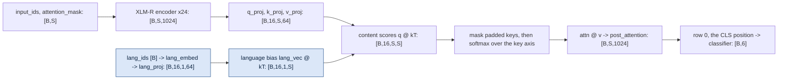
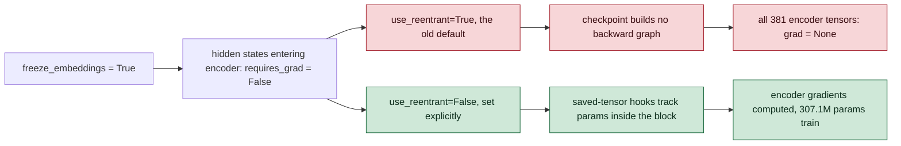

# Model and training

What the architecture is, what the training loop actually does, and why several of the choices are
the way they are. Everything here describes the code on `fix/training-correctness`; where the April
2025 run differed, that is called out, because most of the interesting lessons are in the
difference.

Shape notation used throughout: `B` = batch size, `S` = sequence length in tokens, `H` = number of
attention heads (16), `D` = head dimension (1024 / 16 = 64).

## Architecture

The model is XLM-RoBERTa-large — a 24-layer transformer pretrained on 100 languages — with one
extra attention block and a small classification head bolted on top. The extra block is where the
language conditioning lives. Defined in `model/language_aware_transformer.py`.



The blue path is the only place `lang_ids` enters the network, and the `[B,16,1,S]` shape on the
bias is the difference between the mechanism working and doing nothing at all.

Step by step:

| Stage | Code | Output shape |
|---|---|---|
| XLM-R encoder | `language_aware_transformer.py:214` | `[B,S,1024]` |
| q/k/v projections, split into 16 heads | `:235-242` | `[B,16,S,64]` each |
| content scores, scaled by `1/sqrt(64)` | `:245` | `[B,16,S,S]` |
| language bias added to the scores | `:252-255` | `[B,16,1,S]`, broadcast over queries |
| padded keys masked to `-inf`, softmax | `:258-265` | `[B,16,S,S]` |
| attention output, then `Linear -> LayerNorm -> GELU` | `:267-273` | `[B,S,1024]` |
| classifier on the `[CLS]` row: `1024 -> 512 -> 6` | `:276` | `[B,6]` |

The 6 outputs are independent logits, each turned into a probability by its own sigmoid. There is
no softmax over the labels, because the labels are not mutually exclusive.

## The language bias, and why the shape is the whole bug

This section is the core of the project, and it is worth working through the algebra rather than
taking the conclusion on trust.

### What softmax does to a constant

Attention scores form a matrix `S[i][j]`: how much query position `i` should attend to key position
`j`. Softmax is applied along the key axis `j`, i.e. across each row:

```
softmax(x)_j = exp(x_j) / sum_k exp(x_k)
```

Now add the same constant `c` to every element of that row:

```
exp(x_j + c) / sum_k exp(x_k + c)
  = (e^c * exp(x_j)) / (e^c * sum_k exp(x_k))
  = exp(x_j) / sum_k exp(x_k)
```

The `e^c` factors out of both the numerator and the denominator and cancels. So
`softmax(x + c) = softmax(x)`. This property is called **shift invariance**, and it is normally a
gift: every softmax implementation subtracts `max(x)` before exponentiating to avoid overflow,
which is safe precisely because the result does not change.

Here it is not a gift. It means **any bias that is constant along the axis you are softmaxing over
has exactly zero effect on the output.** Not a small effect. Zero.

### What the April code did

The old bias had shape `[B,H,S,1]` — one number per *query* position, broadcast across all keys.
Written out for 3 queries and 4 keys, the matrix of added values looked like this:

| added to | k1 | k2 | k3 | k4 |
|---|---|---|---|---|
| q1 | +0.7 | +0.7 | +0.7 | +0.7 |
| q2 | -0.2 | -0.2 | -0.2 | -0.2 |
| q3 | +1.4 | +1.4 | +1.4 | +1.4 |

Every row is a constant. Softmax runs along the rows. The bias cancelled exactly, in every head, in
every layer, on every batch. `lang_ids` had no effect on the model output, so `lang_embed` and
`lang_proj` received no useful gradient and never learned anything.

**What this means in practice:** the entire premise of the project was inert for the whole April
run. The trained model was XLM-R plus a language-agnostic attention block. Every per-language
number in the old results reflects XLM-R's own pretraining coverage, not anything this repo did.

### Why the repo's own proposed fix was also wrong

The archived `KNOWN_ISSUES.md` suggested adding the language vector to the **keys**. Work it
through. With `k_j <- k_j + L`:

```
score(i,j) = q_i . (k_j + L) = q_i . k_j + q_i . L
```

The extra term `q_i . L` depends on `i` only. Along a row (fixed `i`, varying `j`) it is again a
constant. It cancels for exactly the same reason. The proposed fix would have produced an
identically inert model, and — worse — one that looks fixed.

### Why adding to the queries works

Add the language vector to the **queries** instead, `q_i <- q_i + L`:

```
score(i,j) = (q_i + L) . k_j = q_i . k_j + L . k_j
```

The extra term `L . k_j` depends on `j`. It is different for every key in the row, so it survives
the softmax and genuinely reshapes the attention distribution:

| added to | k1 | k2 | k3 | k4 |
|---|---|---|---|---|
| q1 | +0.7 | -0.2 | +1.4 | +0.1 |
| q2 | +0.7 | -0.2 | +1.4 | +0.1 |
| q3 | +0.7 | -0.2 | +1.4 | +0.1 |

Read semantically: the language says "in Turkish, tokens that look like *this* are worth attending
to", uniformly for every query in the sequence. That is a reasonable thing for a language signal to
say, and it is a real inductive bias rather than a decoration.

### How it is implemented

`language_aware_transformer.py:252-255`:

```python
lang_emb = self.lang_embed(lang_ids)                                   # [B, 64]
lang_vec = self.lang_proj(lang_emb).view(B, num_heads, 1, head_dim)    # [B, H, 1, D]
attn_scores = attn_scores + torch.matmul(lang_vec, k.transpose(-2, -1)) * self.scale
```

The code never materializes `q + L`. It computes `L . k_j` directly, giving a `[B,H,1,S]` tensor
that broadcasts over the query axis — algebraically identical, and it avoids building a second
`[B,H,S,D]` tensor. Two details that matter:

- `lang_proj` ends in `Tanh` (`:87-91`), so every component of `L` is bounded in `[-1,1]` and the
  bias cannot run away and saturate the softmax early in training.
- The bias is scaled by `self.scale = 1/sqrt(D)` (`:95`), the same factor applied to the content
  scores, so the two terms are in comparable units.
- The attention mask is applied **after** the bias (`:258-262`). Order matters: bias first, then
  force padded keys to `-inf`, so the language term can never leak attention onto padding.

### Measured, not argued

| Test | Old code | Current code |
|---|---|---|
| Logit change from swapping `lang_ids` on identical text | 3.6e-07 | 1.9e-01 |

3.6e-07 is float32 rounding noise. 1.9e-01 is a real effect, five orders of magnitude larger.

**A trap worth remembering:** the old broken model leaks about 4e-08 of float noise into
`lang_embed.grad`. A naive `assert lang_embed.weight.grad is not None and grad.abs().sum() > 0`
therefore **passes** on the broken model. Any test for "does this parameter actually learn" needs a
magnitude threshold, not a comparison against exact zero.

### The ablation switch

`disable_lang_conditioning` (`language_aware_transformer.py:55`, `training_config.py:368`) skips the
whole language branch, turning the model into a language-agnostic control. It can be set from the
environment so the control run needs no code edit:

```bash
TOXIC_DISABLE_LANG_CONDITIONING=1 uv run python -m model.train
```

can be compared from the run table.

**The ablation has been run.** With the mechanism working, conditioning on language makes no
measurable difference: +0.0003 macro AUC on test, 95% CI [−0.0007, +0.0012]. So everything above
describes a bias that now genuinely reshapes attention and that the model does not need. One
practical consequence: `lang_ids` can be omitted at inference with no measurable cost. Numbers and
method in [docs/RESULTS.md](RESULTS.md#the-language-conditioning-ablation) and
[experiments/ablation_language_conditioning.md](../experiments/ablation_language_conditioning.md).

## The loss

`LanguageAwareFocalLoss` (`model/train.py:349`). It is built up in four layers, each answering a
specific problem with this dataset.

**1. Binary cross-entropy, per label.** Six independent binary problems, so six independent BCE
terms. `binary_cross_entropy_with_logits` takes the raw logit `z` rather than a probability and
applies the sigmoid internally, which is numerically stabler than `log(sigmoid(z))` computed in two
steps.

**2. Focal weighting.** Positive rates here range from ~48% for `toxic` down to 2-5% for `threat`,
`severe_toxic` and `identity_hate`. With plain BCE, the sum is dominated by a huge pile of easy
negatives that the model already gets right, and the rare positives barely move the gradient. Focal
loss (Lin et al., 2017) multiplies each term by `(1 - p_t)^gamma`, where `p_t` is the model's
predicted probability of the *correct* answer for that label (`train.py:378-379`):

- Confident and right, `p_t -> 1`: the factor goes to 0, the term nearly vanishes.
- Wrong or unsure, `p_t` small: the factor stays near 1, the term keeps its full weight.

`gamma` sets how sharply this down-weights easy examples. `gamma = 0` is plain BCE; `gamma = 2` is
the usual default.

**3. Alpha, a per-class scale.** `alpha` multiplies each class's term (`train.py:400`), so rare
classes can be made to count for more. Here `alpha` and `gamma` are not constants — both are
recomputed per batch by `DynamicClassWeights.get_weights_for_batch`
(`model/training_config.py:83`) from a running estimate of each language's positive rate, alongside
a per-sample `[B,6]` weight matrix.

**4. Label smoothing.** With hard 0/1 targets, BCE's optimum sits at a logit of plus or minus
infinity, so it keeps pushing already-confident predictions further out forever. `label_smoothing=0.01` moves the targets to
0.005/0.995 (`train.py:385-389`), giving a finite optimum. Only the BCE term is smoothed; the focal
modulation still keys off the hard label, so at `label_smoothing=0` the implementation is
numerically identical to the unsmoothed one.

### The class weighting was dead, and fixing it exposed a second problem

In the April run the weighting never ran, for three independent reasons stacked on top of each
other: `config.lang_weights` was never assigned so the guard always fell through to uniform
parameters; integer language IDs were passed where string codes (`'en'`, `'ru'`) were expected, so
every sample was silently skipped; and the running statistics lived on the CPU while the batch
labels were on the GPU, so the update raised a device-mismatch error on every batch — swallowed by
a bare `except`. Three failures, none of them visible in the logs.

It is active now. Measured on the real data: weights range min 0.41, max 1.42, mean 1.00, with the
rare classes receiving about 2.6x the weight of `toxic`.

Turning it on immediately surfaced two more problems.

**Alpha and gamma were accumulated per sample, not per language.** The loop added each language's
contribution once for every sample of that language, so at batch 128 the totals came out roughly
18x too large and both parameters sat pinned at their clamp ceilings on every single batch — which
means they were constants again, just badly chosen ones. The fix weights each language's
contribution by `lang_count / batch_size` (`training_config.py:170-172`) so the mixing weights sum
to 1.

**Alpha needed normalizing to mean 1.0** (`training_config.py:177-185`). Only the *relative*
weighting between classes matters; the absolute scale multiplies the whole loss, and therefore the
whole gradient. Unnormalized, `alpha` averaged about 4 and true gradient norms ran 53-61.

That collides with gradient clipping. Clipping rescales the gradient vector whenever its norm
exceeds `max_grad_norm` (1.0 here), so that one freak batch cannot blow the weights up. It is meant
to be an outlier guard that fires rarely. At a norm of 55 it fires on *every* step, dividing by
~55x each time: the direction survives, the magnitude is decided entirely by the clip, and the
learning rate you configured no longer means anything. After normalizing, the observed gradient
norm has a median of 0.96 — the clip fires occasionally, as intended.

Normalizing has a second benefit: validation uses fixed `alpha=0.25, gamma=2.0` with no weights
(`train.py:573`), because scoring with running batch statistics would move the target between
epochs and pollute those statistics with validation data. With train-time `alpha` centred on 1.0,
the two losses are on a comparable scale.

## What is frozen, and why

Two separate settings, both meaning what they say (`training_config.py:298-307`):

| Setting | Default | Effect |
|---|---|---|
| `freeze_embeddings` | `True` | freezes `base_model.embeddings` entirely |
| `freeze_layers` | `0` | freezes the first N encoder layer blocks, bottom up |

Applied at `train.py:252-259`, then cross-checked against the real module tree by
`validate_model_config` (`training_config.py:479`), which raises if the intent and the model
disagree.

### Freezing the embeddings is deliberate and worth it

XLM-R's word-embedding matrix is 250k vocabulary entries x 1024 dimensions = **256M parameters**,
roughly 46% of the entire base model. Making it trainable costs a lot:

- AdamW keeps two extra fp32 tensors per trainable parameter — a running mean of the gradient and a
  running mean of its square. At 4 bytes each that is 256M x 4 x 2 = about 2 GB of optimizer state,
  plus another 1 GB for the gradient itself.
- Every step applies a dense update to all 256M weights, even though a batch touches only a few
  thousand distinct vocabulary entries.

Measured at seq 96 / batch 128: freezing the embeddings is a **4.2x wall-clock speedup and a 3x
peak-memory reduction**. It is also defensible on modelling grounds — those subword embeddings were
learned from 2.5 TB of text, and 285k comments are not going to improve them.

**Freezing the embeddings was never the bug.** The bug was what it silently triggered.

### The hazard: frozen inputs plus reentrant checkpointing

**Gradient checkpointing** trades compute for memory. Backpropagation needs the intermediate
activations from the forward pass; for 24 layers at batch 64 x 512 tokens that is a great deal of
memory. Checkpointing throws most of them away and recomputes them during the backward pass —
roughly +30% time for a large memory saving.

PyTorch has two implementations, and they differ in exactly the way that matters here:

| Implementation | How it decides to build a backward graph | Behaviour when only *internal* params need grad |
|---|---|---|
| `use_reentrant=True` (the historical default) | looks at whether the **inputs to the checkpointed segment** require grad | concludes nothing is needed, builds **no graph** |
| `use_reentrant=False` | uses saved-tensor hooks that also track parameters inside the block | builds the graph correctly |

Now chain it together:



Freezing the embeddings makes the hidden states entering the first checkpointed encoder layer carry
`requires_grad = False`. Reentrant checkpointing sees that and concludes the whole segment needs no
backward graph — ignoring the fact that the encoder's own weights, inside the segment, very much do
require one. So no graph is built, every encoder parameter ends the step with `grad = None`, and
AdamW skips parameters whose gradient is `None`. Only the head trains.

Neither ingredient is dangerous alone. Frozen embeddings with non-reentrant checkpointing is fine.
Reentrant checkpointing with trainable embeddings is fine. It is the product that kills the run.

**This is subtle enough that a competent person will walk into it.** It fails completely silently:
no exception, no warning, and the loss still goes down because the head really is learning. The
only symptoms point the wrong way:

| Setting | Time per batch | Peak memory | Encoder gradients |
|---|---|---|---|
| `use_reentrant=True` | 0.218 s | 3.58 GB | **None** |
| `use_reentrant=False` | 0.867 s | 7.33 GB | correct |

A 4x speedup and half the memory looks like a win, not a failure. The second symptom is a training
loss that plateaus higher than it should, which is easy to blame on the learning rate or the data.

**The warning sign to check for, always:** after one backward pass, count the parameters that have
`requires_grad=True` but `p.grad is None`. That number must be zero. `train.py` enables
checkpointing with `use_reentrant=False` explicitly (`:282-292`) and reports the trainable split at
startup via `describe_trainable_parameters` (`:209`).

The April run also froze the wrong things. `freeze_layers=8` was implemented as
`list(base_model.parameters())[:8]` — the first 8 parameter **tensors**, which happened to be 258.6M
parameters (46.2% of the base), almost all of it the word-embedding matrix. The assertion on the
next line checked the same wrong slice, so it passed vacuously. **A test that recomputes the thing
it is testing proves nothing.**

Net effect on the published checkpoint: 4.8M of 565M parameters (0.8%) trained. It is a linear
probe on frozen XLM-R features, and its 0.9147 macro AUC should be read that way.

## Mixed precision

`fp16` (`training_config.py:336`) stores activations and does matmuls in 16-bit floats: half the
memory, and the tensor cores run them faster. The cost is range. The smallest normal positive fp16
value is about 6e-5, so small gradients underflow straight to zero, and large ones overflow to
`inf`.

`torch.amp.GradScaler` (`train.py:836`) handles this by multiplying the loss by a large factor `S`
before `backward()`, which scales every gradient up into fp16's representable range. Before the
optimizer step, `scaler.unscale_(optimizer)` divides them back down. If any gradient came out
non-finite, the step is skipped and `S` is halved; after a stretch of clean steps `S` is raised
again. Overflowing in the first few steps is normal and expected — it is how the scaler finds the
right `S`.

The correct order, at `train.py:514-537`:

```
unscale_  ->  clip_grad_norm_  ->  scaler.step  ->  scaler.update  ->  scheduler.step (only if stepped)
```

`unscale_` must come before clipping, or you would be clipping the scaled gradients and the
threshold would be meaningless.

**The deadlock this replaced.** The April code had a hand-rolled "skip the step if any gradient is
inf" branch that returned early — before `scaler.update()`. That leaves the scaler stuck in its
unscaled stage, so every later `unscale_()` raised `unscale_() has already been called`, and a bare
`except` swallowed it. Measured: after 20 further batches, **zero** parameters had changed. The
first `inf` fires at step 0 deterministically, so this was not a risk, it was a certainty — any run
using that code would have trained nothing at all. There is no skip path now: `scaler.step()` is
already a no-op when the gradients are non-finite, and whether the step happened is read back from
the scale (`train.py:527-530`).

Note the hardware constraint: the Quadro RTX 6000s here are Turing (sm_75), which has neither bf16
nor TF32. fp16 with a loss scaler is the only mixed-precision option available.

## Learning-rate schedule

`build_scheduler` (`train.py:788`) produces linear **warmup** followed by a single half-cosine
decay.

**Warmup** means starting the learning rate at 0 and ramping it linearly to the target over the
first slice of training — 10% of total steps here (`warmup_ratio=0.1`). The reason is that Adam's
second-moment estimate is built from the gradients it has seen, and in the first few steps it has
seen almost nothing, so its step sizes are unreliable. Taking full-size steps then is a good way to
damage pretrained weights before training has learned anything worth keeping.

After warmup, `get_cosine_with_min_lr_schedule_with_warmup` with `num_cycles=0.5` runs **half** a
cosine period: one smooth decay from 2e-5 down to `lr * min_lr_ratio` = 2e-7, with no restarts.

| | April 2025 | Now |
|---|---|---|
| Warmup | `warmup_steps` computed, logged, then never used | linear 0 -> 2e-5 over 10% of steps |
| Decay | `CosineAnnealingWarmRestarts`, `num_cycles=2` | single half-cosine to `lr * 0.01` |

The restarts in the old schedule yanked the learning rate back to maximum twice mid-training, which
is a deliberate technique in some settings but was not a deliberate choice here.

Two details worth copying: the schedule is measured in **optimizer steps**, not batches
(`steps_per_epoch = len(train_loader) // grad_accum_steps`, `train.py:847`), and `scheduler.step()`
is called once per optimizer step and only when AMP did not skip it (`train.py:535-537`). Stepping
the scheduler per epoch, or per batch under accumulation, silently changes the whole schedule.

## Sampler, batching and padding

### Stratified sampling, exactly once per sample

**Stratified sampling** means deliberately constructing each batch to hold the same mix of groups as
the full dataset, rather than trusting randomness to get it right. Here the group is the language,
so every batch should be roughly 1/7 of each.

`MultilabelStratifiedSampler` (`model/data/sampler.py`) shuffles each language's indices, then
fills each batch with that language's proportional share using the largest-remainder method.

The April version drew **with replacement**, and the consequence is a nice piece of arithmetic worth
internalizing. If you draw `n` items with replacement `n` times, a specific item is missed on each
draw with probability `1 - 1/n`, so it is missed entirely with probability `(1 - 1/n)^n`, which
converges to `1/e` ≈ **0.368** as `n` grows. Measured on the real 285,264-row train split, one
epoch:

| | Count | Share |
|---|---|---|
| Unique samples seen | 180,139 | 63.1% |
| Never seen | 105,125 | 36.9% |
| Duplicated | 75,635 | — |
| Most repeats of a single sample | 8 | — |

36.9% is not a measurement artefact — it is `1/e`. The same constant shows up in bootstrap
resampling (why a bootstrap sample covers ~63.2% of the data) and in hash-table collision analysis.

The current sampler does an exact one-pass: 285,264 indices yielded, 285,264 unique, per-batch
language mix within 0.65 samples of the global mix. Ordering is seeded by `seed + epoch` and
`set_epoch` is called each epoch (`train.py:897`), following torch's `DistributedSampler`
convention — so every epoch sees a different order, and rerunning the job reproduces it exactly.

### Padding: bucketing is the whole win

Batches must be rectangular, so short sequences are padded to match the longest one. Padding is
masked out of the loss but still costs full matmuls.

Real token lengths on the train split (XLM-R tokenizer): p50 43, p75 89, p90 171, p95 240, p99 512,
mean 73.4. Padding everything to 512 therefore spends most of its compute on nothing.

Measured at batch 128, padded up to a multiple of 8:

| Strategy | Mean tokens per sequence | Speedup |
|---|---|---|
| Static pad to 512 | 512.0 | 1.00x |
| Dynamic pad, random batch order | 498.0 | 1.03x |
| Length-bucketed, megabatch 20x | 100.6 | **5.1x** |

**Dynamic padding alone is worth essentially nothing at this batch size.** Padding each batch to its
own longest member sounds like the fix, but a random batch of 128 comments almost always contains
one 512-token comment, which drags the whole batch back up. The bucketing is what makes it pay: cut
the index stream into megabatches of `20 x batch_size`, sort by length inside each, form batches
from aligned length slices, then shuffle the *order* of the resulting batches so training time is
not correlated with sequence length (`sampler.py:109-132`). `DynamicPadCollator`
(`model/data/collate.py`) then pads each batch to its own maximum, rounded up to a multiple of 8 for
tensor-core alignment.

Why token count is the right thing to minimize, measured at batch 128 with fp16 and checkpointing:

| Sequence length | 32 | 64 | 128 | 256 | 512 |
|---|---|---|---|---|---|
| Time per batch (s) | 0.267 | 0.456 | 0.862 | 1.762 | 3.863 |

16x the length costs 14.5x the time — close to linear, because at these lengths the per-token
feed-forward work dominates the quadratic attention term.

This optimization also fails silently if the lengths are not wired through, so it is checked twice:
`log_batch_length_profile` (`train.py:1126`) prints the predicted mean padded width at startup, and
the training loop compares it against the first 50 real batches and warns loudly if everything is
padding to `max_length` (`train.py:928-945`). The failure shows up in seconds instead of forty
minutes.

### Batch size and gradient accumulation

`batch_size=64` with `grad_accum_steps=2` gives an effective batch of 128. **Gradient accumulation**
means running two half-sized batches, summing their gradients, and stepping once — mathematically
the same as one batch of 128, provided the loss is divided by the accumulation count first
(`train.py:492-493`), but with half the activation memory live at any moment.

It is not optional here. At batch 128, 512-token batches peak at 18.30 GB against a usable 22.29 GB
and the real loop OOMs. At 64 x 2 the peak is 11.36 GB.

## Validation and checkpoint selection

The April run had **no validation loop at all**. `best_auc` stayed 0.0, no checkpoint was ever
selected, and the published model was picked by hand.

`validate()` (`train.py:558`) now runs a full pass over `val.csv` each epoch. Three things about it
are deliberate:

- **AUC is computed once over the whole concatenated split**, not averaged over batches. AUC is
  undefined when only one label value is present, and a validation batch frequently contains zero
  positives for `threat` — so a per-batch average would either crash or quietly drop those batches,
  biasing the metric toward the batches that happened to contain a rare positive.
- **Degenerate classes are detected with an explicit `np.unique(y_true).size < 2` check** before
  `roc_auc_score` is called, then skipped with a warning and left out of the macro average. The
  check has to be explicit: `roc_auc_score` *returns* `NaN` rather than raising in that case, so
  wrapping the call in `except ValueError` does not catch it. That trap is still live in
  `evaluate.py`.
- **The macro average is unweighted** across the 6 classes, so `threat` counts as much as `toxic`.
  A weighted average would be dominated by `toxic` and would hide exactly the failure mode this
  project cares about.

The best checkpoint is written atomically (`save_best_checkpoint`, `train.py:748`): staged in a
sibling `.tmp` directory and swapped in with `os.replace` once complete. Writing 2.15 GB straight
over the previous best leaves a ~5 second window in which a crash or a Ctrl-C destroys the only
checkpoint that matters.

Epoch checkpoints rotate keep-last-3, sorted by name — which is why the new run writes to a
**separate directory** (`weights/toxic_classifier_xlmr_v2`). Mixing two runs' checkpoints in one
directory would have made the rotation delete the 2025 checkpoints at epoch 4, including the one the
results cite.

## Current configuration

Values as they appear in `model/training_config.py`.

| Parameter | Value | Note |
|---|---|---|
| `model_name` | `xlm-roberta-large` | 24 layers, hidden 1024, 16 heads |
| `max_length` | 512 | evaluation now defaults to 512 as well |
| `batch_size` / `grad_accum_steps` | 64 / 2 | effective batch 128, peak 11.36 GB |
| `epochs` | 6 | |
| optimizer | AdamW, `weight_decay=2e-7` | frozen params excluded from the param groups |
| `lr` | 2e-5 | |
| `use_warmup` / `warmup_ratio` | `True` / 0.1 | linear 0 -> 2e-5 |
| scheduler | cosine with min LR | `num_cycles=0.5`, `min_lr_ratio=0.01` |
| `max_grad_norm` | 1.0 | meaningful again after the alpha normalization |
| `model_dropout` | 0.0 | |
| `freeze_embeddings` | `True` | 256M params, deliberate |
| `freeze_layers` | 0 | encoder layer blocks, none frozen |
| `label_smoothing` | 0.01 | now actually applied |
| `mixed_precision` | `fp16` | Turing has no bf16 or TF32 |
| `activation_checkpointing` | `True` | with `use_reentrant=False` |
| `dynamic_padding` / `pad_to_multiple_of` | `True` / 8 | with length bucketing in the sampler |
| `use_class_weights` | `True` | instantiates `DynamicClassWeights` |
| `eval_every_epoch` / `eval_batch_size` | `True` / 256 | |
| `checkpoint_dir` | `weights/toxic_classifier_xlmr_v2` | separate from the 2025 run |
| `disable_lang_conditioning` | `False` | env `TOXIC_DISABLE_LANG_CONDITIONING=1` for the control |
| `gc_frequency` | 500 | |

Trainable parameters: **307.1M of 565M (54.4%)**, against 4.8M (0.8%) in the April run.

Hardware: 2x Quadro RTX 6000 (24 GB, Turing), 36 cores, 125 GB RAM. Training runs **single-GPU**.
`DataParallel` is implemented and enabled in the config, but it places all optimizer state on device
0 (a 3.8x memory imbalance) and buys nothing at this batch size, so `scripts/train_tmux.sh` defaults
to one visible device.

Wall clock: 35.4 min/epoch *including* a full validation pass, versus 55.5 min/epoch in April. That
is a net comparison, not a controlled one. The current run does roughly 4x the per-step work — it is
actually backpropagating through the encoder — and still comes out faster, because length bucketing
and removing `CUDA_LAUNCH_BLOCKING=1` (measured at 31 ms/batch, 3.7%) more than pay for it.

## Files

```
model/
├── language_aware_transformer.py   # model definition, the language bias
├── train.py                        # training loop, focal loss, validation, checkpointing
├── training_config.py              # TrainingConfig, MetricsTracker, DynamicClassWeights
├── data/sampler.py                 # MultilabelStratifiedSampler, length bucketing
├── data/collate.py                 # DynamicPadCollator
├── predict.py                      # single/batch prediction helpers
├── inference_optimized.py          # OptimizedToxicityClassifier used by the demo apps
└── evaluation/evaluate.py          # ToxicDataset, metrics, threshold search, plots
```

Remaining known problems, including the ones in `evaluate.py`, are tracked in
[KNOWN_ISSUES.md](KNOWN_ISSUES.md).
