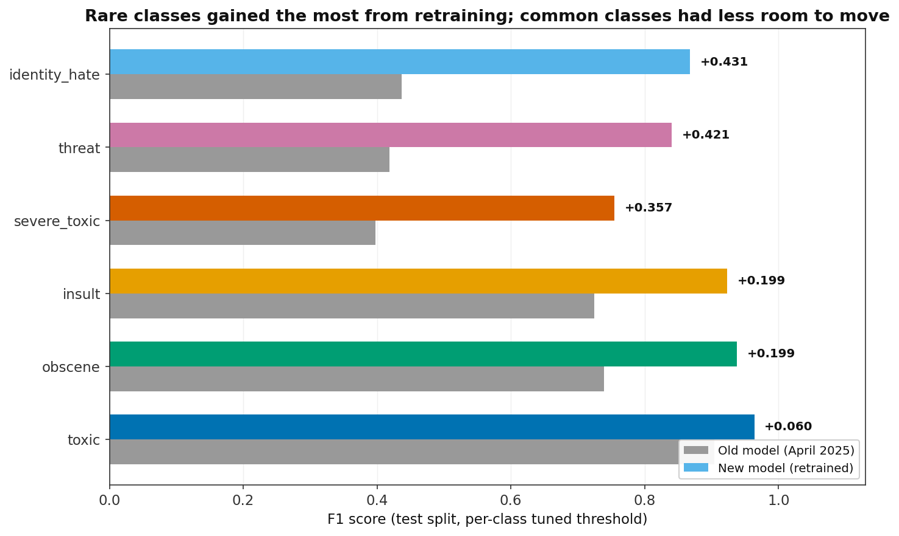
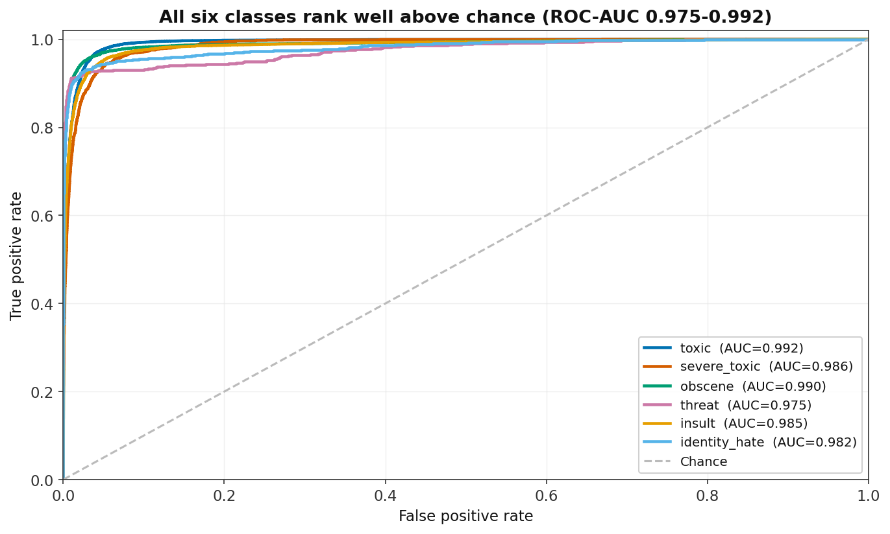
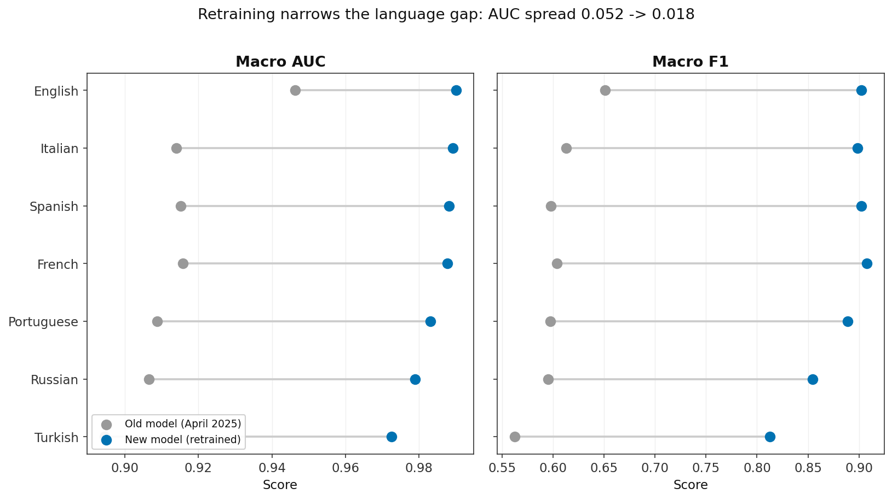
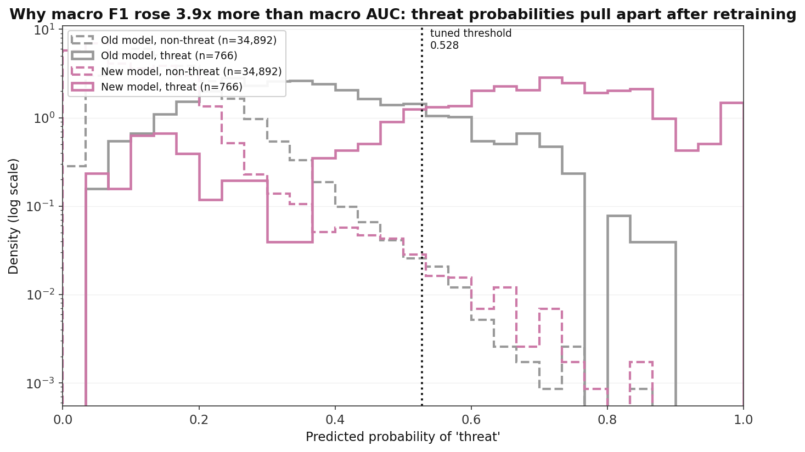
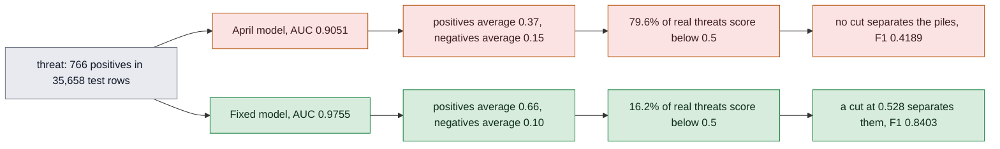
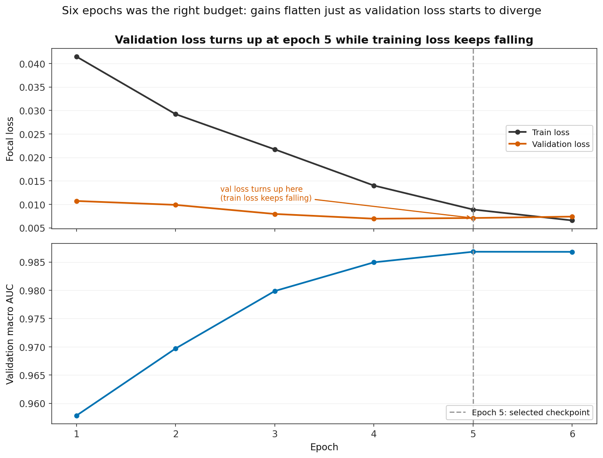

# Results

Final numbers for the model at `weights/toxic_classifier_xlmr_v2/best_model` — epoch 5 of a
6-epoch run, selected on validation macro AUC. Measured on the held-out test split by
`model/evaluation/evaluate.py`, run `evaluation_results/eval_20260830_072515/`.

Every number below is on `dataset/split/test.csv`, 35,658 rows the model never saw during
training and which were never used to pick anything.

## What was measured, and how

The metrics used here, defined once:

| Term | Meaning |
|---|---|
| AUC | Area under the ROC curve. Pick one toxic comment and one clean comment at random; AUC is the probability the model scores the toxic one higher. It only measures **ranking**, so it does not depend on where you draw the yes/no line. 0.5 is chance, 1.0 is perfect. |
| F1 | Harmonic mean of precision (of the comments flagged, what share really were toxic) and recall (of the truly toxic comments, what share got flagged). Unlike AUC it is computed **after** you draw the line, so it depends on where you drew it. |
| Macro average | The six per-class scores averaged with equal weight. `threat`, with 766 positives, counts as much as `toxic`, with 17,697. |
| Weighted average | The same six scores averaged by class frequency, so `toxic` and `insult` dominate. Higher than macro in every table here, because the common classes are also the easy ones. |
| Exact match | The share of comments where **all six** labels are simultaneously correct. One wrong label out of six fails the whole row, so it is the strictest number on the page. |
| Threshold tuning | Each class gets its own probability cut-off, chosen by sweeping candidate values and keeping the one with the highest F1. |

### The protocol, and why it matters

Thresholds were fitted on `dataset/split/val.csv` and then applied **unchanged** to
`dataset/split/test.csv`. Two separate passes, two separate files. `evaluate.py` does this by
default (`--val_file` tunes, `--test_file` reports).

The reason this matters is worth being explicit about. A threshold is a fitted parameter: you
searched for the value that scored best. If you search on the same rows you then report, you are
reporting the best of many attempts on that specific data, and some of that "best" is luck that
will not repeat. The number comes out flattering and means less than it looks like it means. The
earlier version of this document reported tuned F1 measured on the split the thresholds were fit
on, which is exactly that mistake.

Fitting on `val` and reporting on `test` removes it. The thresholds below were chosen without
ever seeing a test row.

## Headline




New model versus the April 2025 published checkpoint, both scored the same way on the same test
split:

| Metric | New | April 2025 | Delta |
|---|---|---|---|
| AUC (macro) | **0.9852** | 0.9147 | +0.0704 |
| F1 (macro) | **0.8814** | 0.6036 | +0.2778 |
| F1 (weighted) | **0.9332** | 0.7732 | +0.1600 |
| Exact match | **0.8772** | 0.6194 | +0.2578 |

Exact match is the one to feel. On 62% of test comments the April model got all six labels right;
the new one gets all six right on 88%.

**Is the baseline being treated fairly?** Its thresholds were picked before the threshold search
was fixed (O1 in [docs/KNOWN_ISSUES.md](KNOWN_ISSUES.md#o1-the-threshold-search-was-a-meaningless-cross-validation--fixed)),
so it is worth checking that a broken search is not what makes it look bad. It is not. Fitting the
corrected sweep directly on the April model's own test predictions — an upper bound no honest
protocol can reach, because it fits and scores on the same rows — reaches macro F1 0.6059 against
the 0.6036 reported here. The baseline is within 0.0023 of its own ceiling, against a measured
improvement of 0.2778.

## Per class




ROC and precision-recall answer different questions, and on this data the second is the honest one.
ROC plots true-positive rate against false-positive rate, and when 98% of rows are negative the
false-positive rate barely moves however many mistakes you make -- the denominator is enormous. So
`threat` looks near-perfect at 0.975 ROC-AUC. The precision-recall curve prices the same model
against the positives only: average precision 0.880, and you can read straight off it what precision
costs you at any recall you might want. Each legend entry carries the class's base rate, because a
PR curve is only interpretable against the prevalence it was measured at.


New model, at the val-tuned thresholds:

| Class | AUC | Threshold | Precision | Recall | F1 | Support |
|---|---|---|---|---|---|---|
| toxic | 0.9921 | 0.4724 | 0.9534 | 0.9750 | 0.9641 | 17,697 |
| obscene | 0.9899 | 0.5276 | 0.9419 | 0.9338 | 0.9378 | 8,626 |
| insult | 0.9855 | 0.5643 | 0.9204 | 0.9266 | 0.9235 | 10,199 |
| identity_hate | 0.9818 | 0.5643 | 0.8959 | 0.8419 | 0.8680 | 1,891 |
| severe_toxic | 0.9863 | 0.4724 | 0.7139 | 0.8010 | 0.7549 | 1,648 |
| threat | 0.9755 | 0.5276 | 0.8846 | 0.8003 | 0.8403 | 766 |

Against the April model, class by class:

| Class | AUC before | AUC after | AUC delta | F1 before | F1 after | F1 delta |
|---|---|---|---|---|---|---|
| toxic | 0.9666 | 0.9921 | +0.0255 | 0.9038 | 0.9641 | +0.0603 |
| obscene | 0.9278 | 0.9899 | +0.0621 | 0.7392 | 0.9378 | +0.1986 |
| insult | 0.9035 | 0.9855 | +0.0820 | 0.7248 | 0.9235 | +0.1987 |
| identity_hate | 0.8866 | 0.9818 | +0.0952 | 0.4370 | 0.8680 | +0.4310 |
| severe_toxic | 0.8988 | 0.9863 | +0.0875 | 0.3980 | 0.7549 | +0.3569 |
| threat | 0.9051 | 0.9755 | +0.0704 | 0.4189 | 0.8403 | +0.4214 |

The three rare classes gained most. `threat`, `severe_toxic` and `identity_hate` roughly doubled
their F1. That is the failure mode this project was supposed to care about, and it is the one that
moved.

`severe_toxic` is still the weakest class at 0.7549, and its precision (0.7139) is well below its
recall (0.8010) — the model over-flags it. It is a fine-grained judgement (how toxic is too toxic)
with only 1,648 positives to learn it from.

## Per language




| Language | AUC (new) | AUC (April) | Delta | F1 macro (new) | Exact match (new) | n |
|---|---|---|---|---|---|---|
| English | 0.9902 | 0.9463 | +0.0439 | 0.9025 | 0.8631 | 4,638 |
| Italian | 0.9893 | 0.9139 | +0.0754 | 0.8985 | 0.8990 | 5,146 |
| Spanish | 0.9882 | 0.9152 | +0.0730 | 0.9023 | 0.9025 | 5,168 |
| French | 0.9877 | 0.9157 | +0.0720 | 0.9075 | 0.9023 | 5,158 |
| Portuguese | 0.9832 | 0.9088 | +0.0744 | 0.8891 | 0.8971 | 5,192 |
| Russian | 0.9790 | 0.9065 | +0.0725 | 0.8545 | 0.8585 | 5,193 |
| Turkish | 0.9726 | 0.8944 | +0.0782 | 0.8128 | 0.8166 | 5,163 |

English is still first and Turkish still last, but the gap between them collapsed: the spread from
best to worst language went from 0.0519 to 0.0176, roughly a third of what it was. English gained
least, because it had the least room to gain.

This ordering tracks XLM-RoBERTa's own pretraining coverage, not anything this repository does per
language — see [the ablation](#the-language-conditioning-ablation) below.

## Why F1 gained four times what AUC did




This is the most instructive number on the page. Macro AUC rose 0.0704; macro F1 rose 0.2778,
about four times as much. The two metrics did not move together because they measure different
things.

**AUC only asks about order.** Does the model put toxic comments above clean ones? The April model
was already decent at that — 0.9147 macro AUC means it ranked a random toxic/clean pair correctly
about 91% of the time. Ranking was never the problem.

**F1 asks about placement.** It needs an actual cut-off, so it depends on *where the probabilities
sit*, not just their order. A model can put every positive above every negative — perfect AUC —
while cramming all of them into the range 0.3 to 0.4. The order is flawless; there is still no
cut-off that produces a good decision, because both piles are in the same place.

That is what a frozen encoder produces. Only the small head on top was learning, and a head reading
fixed, general-purpose features can order examples reasonably while pushing all its probabilities
into a narrow band near the middle. Once the encoder itself trains, the representation changes and
the two piles pull apart.

`threat` shows it most sharply:



Both April facts are true at once: the model ranked nine out of ten threat pairs correctly, and it
still scored four out of five actual threats below 0.5. Good ordering, bad placement.

The same collapse shows up as ambiguity around the cut-off. Counting test rows that land within
±0.10 of the class threshold — the rows where the decision is close to a coin flip:

| Class | April | New |
|---|---|---|
| toxic | 13.3% | 1.8% |
| obscene | 22.0% | 2.0% |
| insult | 26.5% | 2.9% |
| identity_hate | 19.6% | 1.5% |
| severe_toxic | 15.6% | 4.8% |
| threat | 8.3% | 1.0% |

**A consequence worth stating.** Threshold tuning barely does anything for the new model. On test
its macro F1 is 0.8814 at the tuned thresholds and 0.8821 at a flat 0.5 — tuning is worth −0.0007,
i.e. nothing. For the April model, tuning was worth +0.0752 (0.5284 at 0.5, 0.6036 tuned). Needing
a carefully placed threshold is a symptom of probabilities that sit in the wrong place. A
well-separated model does not care much where you put the line, which is also why the numbers here
are robust: they do not depend on the threshold search having got lucky.

## Training curve




Validation macro AUC and losses, per epoch, for the run that produced this model:

| Epoch | Val macro AUC | Gain over previous | Train loss | Val loss |
|---|---|---|---|---|
| 1 | 0.9578 | — | 0.0415 | 0.0107 |
| 2 | 0.9697 | +0.0119 | 0.0292 | 0.0099 |
| 3 | 0.9799 | +0.0102 | 0.0217 | 0.0080 |
| 4 | 0.9849 | +0.0051 | 0.0140 | 0.0070 |
| **5** | **0.9868** | **+0.0019** | 0.0089 | 0.0071 |
| 6 | 0.9868 | −0.00002 | 0.0066 | 0.0074 |

Epoch 5 is the selected checkpoint. Epoch 6 did not beat it (0.986818 against 0.986801).

**Why six epochs was the right budget.** Look at the last two columns. Through epoch 4 both losses
fall together, which is ordinary learning. From epoch 5 they split: train loss keeps dropping
(0.0140 → 0.0089 → 0.0066) while validation loss turns and rises (0.0070 → 0.0071 → 0.0074). That
divergence is the definition of **overfitting** — the model is still improving on the data it can
see and starting to get worse on data it cannot. The AUC gains had already decelerated cleanly
(+0.0119, +0.0102, +0.0051, +0.0019) and then stopped.

More epochs would most likely have cost accuracy, not bought it. Selecting on validation AUC rather
than taking the last epoch is what makes that safe, and the April run had no validation loop at all
— its published checkpoint was picked by hand.

## What changed

One thing, mostly: the encoder actually trains now.

| Run | Parameters receiving gradient | Share of 565M |
|---|---|---|
| April 2025 | 4.8M | 0.8% |
| `fix/training-correctness` | 307.1M | 54.4% |

All 381 weight tensors inside XLM-RoBERTa finished every April backward pass with `grad = None`.
What that run trained was a linear probe on frozen features. Its 0.9147 macro AUC is a fair score
for a linear probe and a poor one for a fine-tuned XLM-R-large.

Two bugs stacked to cause it, and the full diagnosis — including the assertion that could not fail
and should have caught it — is in
[docs/KNOWN_ISSUES.md](KNOWN_ISSUES.md#the-headline-finding-the-encoder-never-trained). It is not
repeated here.

Other fixes in the same branch contribute to the gain and cannot be separated from it without more
ablations than have been run: class weighting now actually runs, the sampler no longer draws with
replacement (36.9% of the data went unseen per epoch), warmup exists, and evaluation no longer
truncates at 128 tokens against training's 512.

## The language-conditioning ablation

The project's design premise is that telling the model which language it is reading, and letting
that signal steer attention, beats plain fine-tuning. That claim is now tested.

**Result: no measurable effect.** Macro AUC 0.9852 with language conditioning on versus 0.9849
with it off — a difference of +0.0003 with a 95% confidence interval of [−0.0007, +0.0012] and
p = 0.588. The interval contains zero.

A **confidence interval** here means: resample the test rows with replacement 1,000 times, rescore
both models on each resample, and record the range covering the middle 95% of the differences. That
range straddling zero says the measured difference is inside the noise of which rows happened to be
in the test set. Three of the seven languages are *worse* with conditioning on, and English moves
−0.0006 against a non-English mean of +0.0003 — the opposite of where a working language signal
should show up.

This is a **null result, not a failure.** The mechanism is correct now: the language bias was
previously constant along the key axis and cancelled exactly under softmax, so `lang_ids` had no
effect on the output at all and there was nothing to ablate. Fixing that made the question
answerable for the first time. The answer is that it does not help on this corpus with this
backbone. XLM-RoBERTa is pretrained on 100 languages and must already represent which language it
is reading; an explicit per-language bias supplies something the model already had.

It is also operationally useful: **`lang_ids` can be omitted at inference with no measurable cost.**
Callers that do not know a comment's language, or do not want to run language detection first, lose
nothing by passing a default.

**The validation numbers said the opposite, and that is the lesson.** Per-epoch validation macro AUC
favoured the treatment in all six epochs (mean +0.0007, sign-test p ≈ 0.016). Six same-sign results
looks like a small real effect. It did not survive on test. The checkpoint was selected on
validation, so the comparison inherited that optimism — this is **selection optimism**: any quantity
you used to make a choice is biased in favour of the choice you made, and can no longer be read as
an unbiased estimate. Had this project reported validation numbers, as its original version did, it
would have concluded that language conditioning works.

Full design, per-class and per-language breakdowns, and the paired-bootstrap details are in
[experiments/ablation_language_conditioning.md](../experiments/ablation_language_conditioning.md).

## Caveats

These are real and they bound how far the numbers above should be carried.

**Near-duplicate leakage in validation.** 3.8% of English validation rows and 0.6% of Russian ones
are near-paraphrases of a training row (char 3-4-gram TF-IDF, cosine ≥ 0.9). Exact-hash dedup ran
and exact overlap between splits is zero, but exact matching does not catch rewordings.
Augmentation ran *before* the split, so synthetic siblings from the same seed comment could land on
opposite sides of it. This inflates validation, which is where the thresholds were fitted; the test
numbers are the headline precisely because they are the cleaner measurement. Detail in
[docs/DATA.md](DATA.md#split-hygiene).

**The corpus is about half toxic; real traffic is not.** 17,697 of 35,658 test rows carry the
`toxic` label — 49.6%. Live moderation queues run at a few percent.

This matters because **precision depends on the base rate and recall does not.** Recall asks "of
the real positives, how many did we catch", and the answer does not change if you add more
negatives. Precision asks "of the ones we flagged, how many were real", and every extra negative is
another chance for a false alarm. Hold the model's true-positive and false-positive rates fixed and
vary only the mix:

| Class | Corpus base rate | Precision measured | Precision at 5% | Precision at 1% |
|---|---|---|---|---|
| toxic | 49.6% | 0.953 | 0.52 | 0.17 |
| insult | 28.6% | 0.920 | 0.60 | 0.23 |
| obscene | 24.2% | 0.942 | 0.73 | 0.34 |
| identity_hate | 5.3% | 0.896 | 0.89 | 0.61 |
| severe_toxic | 4.6% | 0.714 | 0.73 | 0.34 |
| threat | 2.1% | 0.885 | 0.95 | 0.78 |

**`toxic` is the number to distrust most.** Its 0.953 precision is propped up by a corpus where
half of everything is toxic; at a realistic 5% it is roughly a coin flip, and at 1% two in three
flags would be wrong. The rare classes barely move, because their corpus rates are already close to
realistic.

Two limits on that table. It assumes the true-positive and false-positive rates carry over
unchanged, which only holds if live comments look like these comments apart from the mix — they
will not. And AUC is unaffected by the base rate entirely, which is part of why it is the headline
ranking metric. **No calibration against a realistic base rate has been done.** These projections
are arithmetic on the measured operating point, not a measurement.

**Rare-class labels are partly synthetic and weak.** About 500 rows of `threat` and
`identity_hate` were generated by Mistral-7B and labelled by whatever the generation prompt asked
for — no human confirmed that a generated comment reads as a genuine threat. The sklearn validator
that filtered them was trained on the same distribution the generator was imitating, so it is
structurally unable to catch a generation that mimics the target style while being subtly wrong.
Read `threat` and `identity_hate` numbers as an upper bound on real-world performance, not an
estimate of it. Detail in [docs/DATA.md](DATA.md#augmentation).

**One run per arm.** There is no seed-variance estimate. The ablation's paired bootstrap quantifies
uncertainty from the test sample, not from run-to-run training noise, so a difference of ±0.001
between any two training runs should not be treated as meaningful.

**A fabricated weight table was active.** `class_adjustments`
(`model/training_config.py:122-130`) applies per-language, per-class multipliers presented as
"based on statistical analysis"; five of six non-English rows are byte-identical and the comments
contradict the values. It distorts class weights by about 3.5%. It was active in this run. It was
active identically in both ablation arms, so it cancels in that comparison, but it is an
unjustified number in the loss that produced the headline model. Tracked as O8 in
[docs/KNOWN_ISSUES.md](KNOWN_ISSUES.md#o8-class_adjustments-is-fabricated-and-now-live).

## Two things that were tried and did not work

Both are negative results, measured rather than assumed, and both have now been run against the
retrained model as well as the April one. The conclusions hold on both.

| Idea | Result |
|---|---|
| Per-language thresholds instead of one global threshold per class | **Worse on both models.** Retrained: −0.0016 macro F1, **0 of 5 splits improved**. April: −0.0047, 1 of 5 improved and that one by exactly zero. Seven thresholds fit on a seventh of the data each is variance, not signal. [Writeup](../experiments/per_language_thresholds.md) |
| Enforce the label hierarchy, clamping `P(child) <= P(toxic)` | **No effect on either model.** Retrained +0.0000, April −0.0001. [Writeup](../experiments/label_hierarchy.md) |

The hierarchy result is worth reading in full, because re-running it corrected the explanation. The
original write-up said the clamp does nothing because the model already respects the constraint —
only 2.35% of April's rows violated it. The retrained model violates it on **35–50% of rows**, by a
larger margin, and clamping still changes nothing.

The real reason is that violations happen where the decision is not close. A clamp can only flip a
prediction when `P(child)` is above its threshold while `P(toxic)` is below it, and that combination
occurs on 0.006–0.244% of rows. For `threat`, 99% of violations sit below `P = 0.3`, on comments the
model is confidently calling negative for both labels. `P(threat) = 0.18` against `P(toxic) = 0.04`
breaks the rule, and clamping it to 0.04 is a change no threshold will notice.

So the model has not learned the hierarchy as a hard rule — the violation rates rule that out. It
has learned to be correctly ordered where the decision boundary is, and loosely ordered where
nothing depends on it. That is a more interesting thing to know about it than the original
explanation, and it only surfaced by re-running the experiment rather than assuming the old result
carried over.

Threshold tuning is also worth much less than it was. On the retrained model, per-class tuned
thresholds beat a flat 0.5 by 0.0007 macro F1; on the April model the same tuning was worth +0.0752.
When probabilities are well separated, where you put the cut-off stops mattering — which is the same
fact the [AUC-versus-F1 section](#why-f1-gained-four-times-what-auc-did) describes from the other
direction.

## Reproducing

```bash
uv run python -m model.evaluation.evaluate \
    --model_path weights/toxic_classifier_xlmr_v2/best_model
```

Defaults are already correct on this branch: `--val_file dataset/split/val.csv` tunes the
thresholds, `--test_file dataset/split/test.csv` reports with them, and `--max_length 512` matches
training. `--model_path` still defaults to the 2025 checkpoint directory, so pass it explicitly.

Results land in `evaluation_results/eval_<timestamp>/`. The run behind this document is
`eval_20260830_072515`; the ablation control arm is `eval_20260830_123615`; the April baseline is
`eval_20260830_011818`. Each directory keeps `predictions.npz` (raw probabilities, labels and
language ids), so per-class and per-language numbers can be recomputed on CPU without rerunning the
model.
