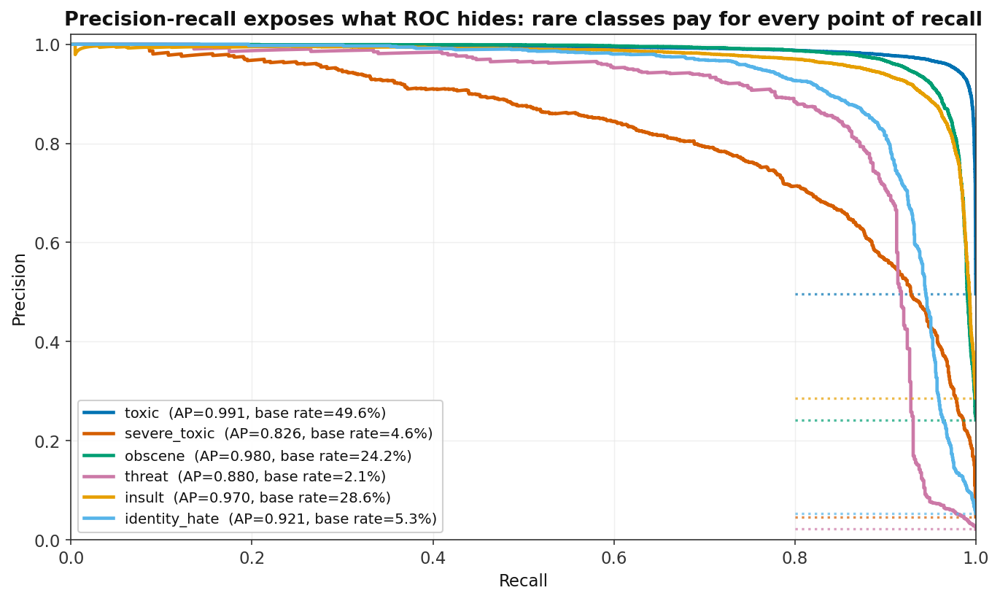

---
language:
  - en
  - ru
  - tr
  - es
  - fr
  - it
  - pt
license: apache-2.0
library_name: transformers
pipeline_tag: text-classification
base_model: xlm-roberta-large
tags:
  - toxicity
  - content-moderation
  - multilingual
  - multi-label
  - xlm-roberta
  - custom_code
metrics:
  - roc_auc
  - f1
model-index:
  - name: Mill (toxic-comment-multilingual-xlmr)
    results:
      - task:
          type: text-classification
          name: Multi-label toxicity classification
        dataset:
          type: custom
          name: Multilingual Jigsaw-derived toxicity corpus (7 languages)
          split: test
        metrics:
          - type: roc_auc
            name: Macro AUC-ROC
            value: 0.9852
          - type: f1
            name: Macro F1 (tuned thresholds)
            value: 0.8814
          - type: f1
            name: Macro F1 (threshold 0.5)
            value: 0.8821
---

> ## Known bias: identity terms are over-flagged
>
> **This model flags benign self-description containing identity terms as toxic.**
> Measured, not hypothetical:
>
> | Input | P(toxic) | P(identity_hate) |
> |---|---|---|
> | "I am a gay man." | **0.891** | 0.336 |
> | "I am a lesbian." | **0.668** | 0.165 |
> | "I am a black man." | **0.612** | 0.554 |
> | "I am a queer person." | **0.531** | 0.075 |
> | "I am a deaf person." | **0.485** | 0.108 |
> | "I am a man." | 0.067 | 0.088 |
> | "I am a woman." | 0.038 | 0.087 |
>
> At the tuned `toxic` threshold of 0.472, the first five are flagged. Neutral
> controls are not. The model has learned that the presence of an identity term
> predicts toxicity, which is not the same thing as the comment being toxic.
>
> **The cause is in the training data, not the training code.** In the English
> training split, 91.2% of comments containing "gay" are labelled toxic against a
> 48% base rate, and 53.1% are labelled `identity_hate` -- an 11.5x lift over the
> 4.6% base rate. The corpus derives from Wikipedia talk-page comments, where
> identity terms appear overwhelmingly in hostile arguments *about* those groups.
> Benign usage is barely represented, so the model never had the chance to learn
> the distinction.
>
> **What this means if you deploy it.** Used as-is for moderation, this model will
> disproportionately suppress LGBTQ people, and to a lesser extent racial and
> religious minorities, describing themselves. That is the opposite of what a
> toxicity filter is for. Do not use it on user-generated content without either
> mitigating this or reviewing flagged identity-term content by hand.
>
> **It is worse in every other language.** The numbers above are English, which
> is the *least* affected of the seven. False-positive rate on benign
> identity-term probes, by language:
>
> | pt | ru | tr | es | fr | it | en |
> |---|---|---|---|---|---|---|
> | 0.741 | 0.704 | 0.667 | 0.667 | 0.593 | 0.556 | **0.407** |
>
> Non-identity controls score 0.000 in all seven languages.
>
> **The trigger is short text.** Prepending a paragraph of neutral filler drops
> "I am a gay man." from 0.891 to 0.042. The model learned *short sentence +
> identity term = toxic*, which matches the corpus: short comments containing
> "gay" are 95.6% toxic against 76.0% for long ones. The harm therefore
> concentrates in bios, chat messages, one-line replies and usernames -- short
> user-generated text, which is most of what a moderation system sees.
>
> **It is not confined to synthetic probes.** On held-out test rows carrying no
> positive label, those containing an identity term are flagged at 0.120 against
> 0.042 for those that do not -- **2.84x**, bootstrap CI [1.96, 3.82].
>
> **Cause: representation, not mislabelling.** Of 726 English training rows
> containing "gay", 90.4% are labelled toxic and most are correctly labelled --
> they really are abusive. The problem is the absence of the other kind. 36 rows
> match a first-person LGBT self-description pattern and **not one is a genuine
> benign self-description**; they are mockery-by-impersonation and harassment. The
> sentence form this model fails on exists in its training data only as a vehicle
> for abuse, so the model never had the chance to learn otherwise.
>
> This is a known failure mode of this corpus -- Jigsaw hit it themselves and
> addressed it by adding benign examples containing identity terms. That
> mitigation has not been applied here. Full analysis, including a costed fix and
> the recall trade-off it implies, is in
> [experiments/identity_bias.md](https://github.com/Deeptanshuu/Toxic-Comment-Classification-using-Deep-Learning/blob/main/experiments/identity_bias.md).
> It is documented rather than quietly shipped because a model card that omits a
> measured harm is worse than no card.


# Mill (toxic-comment-multilingual-xlmr)

**A fast, single-pass model for toxicity: unstructured comment in, typed probabilistic decisions out.**

Multi-label toxicity classification for online comments in seven languages:
English, Russian, Turkish, Spanish, French, Italian, Portuguese.

The model is XLM-RoBERTa-large with one extra attention block on top whose
attention scores carry a per-language bias, followed by a small classification
head. It emits six independent probabilities per comment in a single forward
pass. It does not generate text: the output is six sigmoids, so the result is
always a fixed-shape vector you can drop into a moderation workflow as a
function call.

The idea is similar to TypeSafe's
[Jev](https://typesafe.ai/blog/introducing-system-one-models-and-jev), applied
here to one use case: multilingual toxicity moderation. Mill is an independent
project and is not affiliated with TypeSafe. The scores are ranks, not
calibrated probabilities, and latency has not been measured, so this card makes
no claim on either.

**Read the [Known limitations](#known-limitations) and
[Out-of-scope use](#out-of-scope-use) sections before you deploy this.**

---

## What the six labels mean

| Label | Index | Meaning in the source annotation scheme |
|---|---|---|
| `toxic` | 0 | Rude, disrespectful, or likely to make someone leave a discussion |
| `severe_toxic` | 1 | An extreme case of the above. In the source scheme this is a *subset* of `toxic` |
| `obscene` | 2 | Obscene or vulgar language |
| `threat` | 3 | A threat of violence against a person or group |
| `insult` | 4 | Insulting, inflammatory, or negative toward a person |
| `identity_hate` | 5 | Hatred toward an identity group: race, religion, gender, sexuality, nationality |

The index column is the position in the output vector. It is worth memorising
that index 1 is `severe_toxic` and index 2 is `obscene`, because that is neither
alphabetical nor the order most people assume.

### Why six sigmoids and not a softmax

The labels are **non-exclusive**. A single comment can be toxic *and* obscene
*and* an insult at the same time, and most toxic comments in the training data
carry two or three labels at once. That is a different problem from picking one
class out of six.

A softmax forces the six scores to sum to 1, so raising one necessarily lowers
the others. That is exactly wrong here: the fact that a comment is obscene
should not reduce the model's belief that it is also an insult.

So the head produces six raw scores (logits) and each one goes through its own
sigmoid independently:

```
p_k = 1 / (1 + exp(-logit_k))    for k = 0..5
```

Each `p_k` is that class's own answer to its own yes/no question. The six values
do not sum to anything in particular. You compare each one to its own threshold
and take every class that clears it.

---

## Quick start

This is a **custom architecture**, not a stock Hugging Face model. `AutoModel`
alone will not build it. The model definition ships in this repo as
`modeling_toxic_xlmr.py`, and you need `trust_remote_code=True` so that
`transformers` will execute it.

```python
import json, torch
from huggingface_hub import hf_hub_download
from transformers import AutoModel, AutoTokenizer

REPO = "Deeptanshuu/toxic-comment-multilingual-xlmr"
LANGUAGE_IDS = {"en": 0, "ru": 1, "tr": 2, "es": 3, "fr": 4, "it": 5, "pt": 6}
LABELS = ["toxic", "severe_toxic", "obscene", "threat", "insult", "identity_hate"]

model = AutoModel.from_pretrained(REPO, trust_remote_code=True).eval()
tokenizer = AutoTokenizer.from_pretrained(REPO)

with open(hf_hub_download(REPO, "thresholds.json")) as f:
    thresholds = json.load(f)["thresholds"]
cut = torch.tensor([thresholds[name] for name in LABELS])

texts = ["You are an absolute idiot.", "Sei un cretino, vattene via."]
langs = ["en", "it"]

enc = tokenizer(texts, padding=True, truncation=True, max_length=512, return_tensors="pt")
lang_ids = torch.tensor([LANGUAGE_IDS[l] for l in langs])

with torch.no_grad():
    probs = model(
        input_ids=enc["input_ids"],
        attention_mask=enc["attention_mask"],
        lang_ids=lang_ids,
    )["probabilities"]

for text, row in zip(texts, probs):
    fired = [name for name, p, t in zip(LABELS, row, cut) if p >= t]
    print(text, "->", fired or ["clean"])
```

`inference_example.py` in this repo is the same thing as a runnable script with
batching, and it is the version that has actually been executed end to end.

### If you would rather not run remote code

`modeling_toxic_xlmr.py` also contains a plain `load_model()` helper. Download
the repo, then:

```python
from huggingface_hub import snapshot_download
import sys

path = snapshot_download("Deeptanshuu/toxic-comment-multilingual-xlmr")
sys.path.insert(0, path)

from modeling_toxic_xlmr import load_model
model, tokenizer = load_model(path, device="cpu")
```

This constructs the module and calls `load_state_dict` directly. No auto
classes, no dynamic module machinery. You are still executing the same Python
file, but you can read it first, which is the point.

---

## The `lang_ids` input, which will trip you up

The forward pass takes **three** inputs, not the usual two:

```python
model(input_ids=..., attention_mask=..., lang_ids=...)
```

`lang_ids` is a `LongTensor` of shape `[batch_size]`, one integer per sequence:

| Language | `lang_id` |
|---|---|
| English | 0 |
| Russian | 1 |
| Turkish | 2 |
| Spanish | 3 |
| French | 4 |
| Italian | 5 |
| Portuguese | 6 |

The model looks the id up in a learned embedding table and uses it to bias the
attention scores in the final block. It is the one place language identity
enters the network.

**If you omit `lang_ids`, the model does not fail.** It fills the batch with
zeros, which means every comment is scored as if it were English. You get a
`UserWarning` once per process. Individual logits shift (about 0.19 in L2
norm), but the language-conditioning ablation found no measurable accuracy cost
to omitting it. Pass it anyway when you know the language.

The same applies to the `text-classification` pipeline, which works but cannot
pass `lang_ids`:

```python
# Works, but treats every input as English and applies no thresholds.
from transformers import pipeline
pipe = pipeline("text-classification", model=REPO, trust_remote_code=True, top_k=None)
```

Ids outside 0-6 are clamped into range with a warning rather than raising. If
your text is in a language not in the table, there is no good id to pass: this
model has never seen that language's toxicity labels, and picking the
typologically nearest option is a guess, not a fallback.

---

## Thresholds: do not use 0.5

`thresholds.json` holds one decision threshold per class. Use it.

The thresholds were chosen to maximise per-class F1 on the validation split and
range from 0.47 to 0.56. There are no per-language thresholds.

---

## Intended use

- Flagging comments for **human** review in a moderation queue.
- Prioritising a review backlog by likely severity.
- Research and coursework on multilingual toxicity detection, multi-label
  classification, or threshold calibration on imbalanced data.
- A baseline to beat.

## Out-of-scope use

**Do not use this as the sole automated decision-maker for moderation.** No
comment should be deleted, no account banned, and no user penalised on this
model's output alone. It is a triage aid. Keep a human in the loop for anything
with a consequence attached.

Beyond that:

- **Performance is uneven across languages.** English scores 0.990 macro AUC,
  Turkish 0.973 (see [Results](#results)). A single global threshold is tighter
  or looser in practice depending on the language.
- **Reclaimed slurs and in-group language are a known failure mode of this class
  of model.** Communities that use slurs about themselves affectionately, drag
  and roast culture, AAVE, and queer in-group speech all reliably draw false
  positives from toxicity classifiers trained on annotator judgements of the
  kind used here. This model has not been evaluated for that, which means the
  problem is unmeasured, not absent. Deploying it against a community that talks
  that way will disproportionately flag that community.
- **Quoted and counter-speech toxicity is scored the same as first-person
  toxicity.** A comment reporting abuse, or quoting a slur to object to it,
  looks much like the abuse itself to this model.
- **Not a substitute for a threat-assessment process.** The `threat` class is
  the rarest and among the weakest. Do not route safety-critical escalation
  through it.
- **Not calibrated probabilities.** A score of 0.8 does not mean 80% of
  annotators would call the comment toxic. Treat the outputs as ranks, and use
  the thresholds.
- **The base rate in the evaluation data is nothing like a real queue.** Roughly
  half the comments in this corpus are labelled `toxic`. A live moderation
  stream is typically a few percent. Precision on real traffic will be
  substantially worse than any precision figure in this card, because precision
  depends on the base rate and the base rate here is inflated by roughly an
  order of magnitude. This is the single most common way people are disappointed
  by a toxicity classifier in production.
- Not intended for languages outside the seven listed, for long-form documents,
  or for detecting misinformation, spam, or self-harm content.

---

## Training data

Built from Jigsaw toxic comment data, extended to seven languages. 356,580
comments, split 285,264 train / 35,658 validation / 35,658 test, roughly balanced
across languages (about 14.5% each; English 13.0%).

Class balance is heavily skewed: roughly 48-50% `toxic`, but only 2-5% for
`threat`, `severe_toxic` and `identity_hate`.

### Provenance limits you should know about

These are real caveats, not disclaimers.

- **The script that produced the multilingual corpus is not in the source
  repository.** The pipeline is reproducible from the multilingual CSV onward,
  but the step that got from Jigsaw's English data to seven languages is not.
  Nobody outside the project can audit or rerun it.
- **The label definitions are English Wikipedia talk-page definitions.** The
  original Jigsaw annotation guidelines were written for one community, in one
  language, at one point in time. Whatever the missing step did to carry those
  labels into Russian, Turkish, Spanish, French, Italian and Portuguese,
  the label semantics for those six languages are inherited from an unauditable
  process. Non-English performance numbers should be read with that in mind.
- **Rare classes were topped up with synthetic data.** `threat` in particular
  was augmented with samples generated by Mistral-7B-Instruct-v0.3 in 4-bit.
  Their labels come from the generating prompt, not from annotation, so they are
  weakly labelled. The lightweight classifier used to filter the generated
  samples was trained on the same distribution it filters, which is circular:
  it keeps the synthetic samples that look like what the model already believes
  toxicity looks like, and discards the ones that would have taught it something
  new.
- **Measured near-duplicate leakage.** Exact `comment_text` overlap between
  splits is zero. But near-duplicates (character 3-4-gram TF-IDF, cosine at or
  above 0.9 against train) account for **3.8% of English validation rows and
  0.6% of Russian**. The cause is that augmentation runs before the split, so
  LLM-generated variants of the same seed text can land on both sides. Exact-hash
  deduplication does not catch these. Held-out numbers are therefore mildly
  optimistic on top of everything else.

---

## Evaluation protocol

Thresholds are tuned on the **validation** split. All reported metrics are
computed on the **held-out test** split, which was not used for tuning or model
selection.

**Why that separation matters.** Per-class thresholds are free parameters, six of
them. If you pick the thresholds that maximise F1 on a split and then report F1
on that same split, you have fitted those six parameters to that split's noise
and are reporting the fit as if it were a prediction. The number goes up and
means less. AUC is threshold-free and so is unaffected, which is exactly why AUC
and F1 can disagree about whether a change helped.

Evaluation uses `max_length=512`, matching training.

---

## Results

Compared with v1 (2025), same test split and protocol:

| Metric | This model | v1 (2025) |
|---|---|---|
| Macro AUC | **0.9852** | 0.9147 |
| Macro F1 at tuned thresholds | **0.8814** | 0.6036 |
| Weighted F1 | **0.9332** | 0.7732 |
| Exact match | **0.8772** | 0.6194 |




Read the precision-recall curves rather than the ROC ones if you are deciding whether to deploy
this. With three labels at 2-5% positive rate, ROC flatters the model because the false-positive
rate is divided by an enormous negative pool. Precision-recall prices the same predictions against
the positives, and each legend entry carries the label's base rate so the curve can be read against
the prevalence it was measured at.

Measured on `best_model` (epoch 5 of a 6-epoch
run that completed all 6 epochs), evaluation run
`evaluation_results/eval_20260830_072515`.

| Metric (test split) | Value |
|---|---|
| Macro AUC-ROC | 0.9852 |
| Weighted AUC-ROC | 0.9890 |
| Macro F1 at threshold 0.5 | 0.8821 |
| Macro F1 at tuned thresholds | 0.8814 |
| Weighted F1 at tuned thresholds | 0.9332 |
| Exact match | 0.8772 |

Per class, on the test split at tuned thresholds:

| Class | AUC | Threshold | Precision | Recall | F1 |
|---|---|---|---|---|---|
| `toxic` | 0.9921 | 0.4724 | 0.9534 | 0.9750 | 0.9641 |
| `severe_toxic` | 0.9863 | 0.4724 | 0.7139 | 0.8010 | 0.7549 |
| `obscene` | 0.9899 | 0.5276 | 0.9419 | 0.9338 | 0.9378 |
| `threat` | 0.9755 | 0.5276 | 0.8846 | 0.8003 | 0.8403 |
| `insult` | 0.9855 | 0.5643 | 0.9204 | 0.9266 | 0.9235 |
| `identity_hate` | 0.9818 | 0.5643 | 0.8959 | 0.8419 | 0.8680 |

Per language, macro AUC on the test split:

| Language | Macro AUC |
|---|---|
| English | 0.9902 |
| Russian | 0.9790 |
| Turkish | 0.9726 |
| Spanish | 0.9882 |
| French | 0.9877 |
| Italian | 0.9893 |
| Portuguese | 0.9832 |

`metrics.json` in this repo carries the same values in machine-readable form.

---

## What this looks like on real traffic

Every number above is measured on a corpus that is roughly **50% toxic**. Real
moderation queues are not. A typical forum or comment stream runs somewhere
between 1% and 5% toxic, and that difference matters more than any metric on this
page.

Recall and false-positive rate are properties of the model and do not change with
the mix of your data. Precision does:

```
precision = TPR * p / (TPR * p + FPR * (1 - p))
```

where `p` is the share of your traffic that is genuinely toxic. Applying the
model's measured TPR and FPR at three prevalences:

| Label | Recall | FPR | Precision @ 50% | @ 5% | @ 1% |
|---|---|---|---|---|---|
| toxic | 0.975 | 0.0470 | 0.953 | 0.522 | **0.173** |
| insult | 0.927 | 0.0321 | 0.920 | 0.603 | 0.226 |
| obscene | 0.934 | 0.0184 | 0.942 | 0.728 | 0.339 |
| severe_toxic | 0.801 | 0.0156 | 0.714 | 0.730 | 0.342 |
| identity_hate | 0.842 | 0.0055 | 0.896 | 0.890 | 0.608 |
| threat | 0.800 | 0.0023 | 0.885 | 0.948 | **0.779** |

**Read the last column before deploying anything.** On a stream that is 1% toxic,
the `toxic` head flags roughly six comments for every one that is genuinely
toxic. That is not a defect in training -- it is arithmetic. A 4.7% false-positive
rate against 99% clean traffic produces far more false positives than there are
true positives to find.

Two consequences worth planning around:

- **The rare-class heads hold up best.** `threat` and `identity_hate` have
  false-positive rates of 0.2% and 0.6%, so they stay usable at low prevalence
  (0.78 and 0.61 precision at 1%). This is the opposite of the usual expectation
  and is worth exploiting: the heads you would expect to be weakest are the ones
  that survive a realistic base rate.
- **Raise the thresholds if you need precision.** The shipped thresholds maximise
  F1 on a balanced corpus. If you are triaging a low-toxicity stream and care
  about not wasting reviewer time, tune your own thresholds on a sample of *your*
  traffic, not on this corpus. `thresholds.json` is a starting point, not a
  recommendation for your distribution.

Nothing here is unique to this model; any classifier trained on a balanced corpus
behaves this way off-distribution. It is stated explicitly because most model
cards do not, and people are repeatedly surprised by it in production.

## Known limitations

- **Language conditioning: a measured null result.** The ablation has been run:
  a control model, trained identically except for `disable_lang_conditioning=True`,
  scores macro AUC 0.9849 on the test split against 0.9852 for the treatment — a
  difference of +0.0003 with a paired-bootstrap 95% CI of [-0.0007, +0.0012]
  (p = 0.588). The interval includes zero, and the per-language breakdown is
  mixed-sign (3 of 7 languages score worse with conditioning on), so this is not
  a case of a small effect concentrated where it should be. Language-aware
  attention does not measurably improve accuracy on this corpus with this
  backbone. That is a measured outcome, not a failure: the mechanism is
  confirmed live (see the `lang_ids` section above), it simply does not buy
  anything here. The practical consequence is useful to a downstream user:
  `lang_ids` can be omitted at inference with no measurable cost to accuracy,
  even though the pathway still shifts individual logits by a measurable amount
  when it is used.
- Non-English label semantics are inherited from a corpus-building step that is
  not in the repository and cannot be audited. See
  [Training data](#training-data).
- Rare-class performance is limited by rare-class data, and part of that data is
  weakly labelled synthetic text.
- The measured near-duplicate leakage (3.8% English validation) makes held-out
  metrics slightly optimistic.
- Fairness has not been evaluated. There is no subgroup analysis, no test for
  identity-term bias, and no evaluation on reclaimed-slur or in-group language.
  Absence of a measured problem is not evidence of absence.
- Weights ship as a pickled `pytorch_model.bin` state dict rather than
  safetensors, because that is what the training loop writes.
- `severe_toxic` is a subset of `toxic` in the annotation scheme, so the two are
  strongly correlated by construction. Independent sigmoids do not know that.

---

## Files in this repo

| File | What it is |
|---|---|
| `modeling_toxic_xlmr.py` | The model definition. Loaded by `trust_remote_code=True`, or importable directly for `load_model()` |
| `config.json` | Architecture config, including the nested XLM-RoBERTa encoder config and the `auto_map` that points the auto classes at the file above |
| `pytorch_model.bin` | Trained weights, a raw state dict (about 2.2 GB) |
| `thresholds.json` | Per-class decision thresholds tuned on validation, plus their provenance |
| `metrics.json` | Evaluation results, machine-readable |
| `training_config.json` | The exact configuration the training run used |
| `inference_example.py` | Runnable batch-prediction example with thresholds applied |
| tokenizer files | Stock `xlm-roberta-large` tokenizer, unmodified, shipped so the repo is self-contained |

## Training configuration

Full detail in `training_config.json`. The parts that matter:

| Setting | Value |
|---|---|
| Base model | `xlm-roberta-large` (24 layers, hidden 1024, 16 heads) |
| Max sequence length | 512 |
| Batch size | 64 with gradient accumulation 2 (effective 128) |
| Epochs | 6 |
| Optimizer | AdamW, lr 2e-5, weight decay 2e-7 |
| Schedule | Linear warmup over 10% of steps, then cosine to 1% of peak |
| Mixed precision | fp16 |
| Gradient checkpointing | Enabled, `use_reentrant=False` |
| Frozen | Embedding module only (256M parameters), deliberately |
| Loss | Focal loss over BCE-with-logits, with per-language dynamic class weights |
| Hardware | Single Quadro RTX 6000 (24 GB) |

`use_reentrant=False` is not a detail. It costs about 4x the step time and twice
the memory of the reentrant variant, and it is the difference between the
encoder receiving gradients and receiving nothing at all.

---

## License

Apache 2.0.

The base model, `xlm-roberta-large`, is MIT licensed. Apache-2.0 is a permissive
license compatible with that, and it additionally grants an explicit patent
license that plain MIT does not — that is why it was chosen here rather than
just inheriting MIT as-is.

This license covers the model weights and the code in this repository. It does
**not** extend to the underlying training data:

- The training data derives from Jigsaw's toxic comment dataset and Wikipedia
  talk-page comments, which carry their own terms.
- Rare-class synthetic augmentation was generated with
  Mistral-7B-Instruct-v0.3, which carries its own license.

Using these weights does not grant any rights to that underlying data. This
card licenses what this repository ships — weights and code — and makes no
claim about, and does not settle, what the source data's own terms permit.

## Citation

```bibtex
@misc{mill_toxicity,
  author       = {Deeptanshu Lal},
  title        = {Mill: multilingual multi-label toxicity classification},
  year         = {2026},
  howpublished = {\url{https://huggingface.co/Deeptanshuu/toxic-comment-multilingual-xlmr}}
}
```
