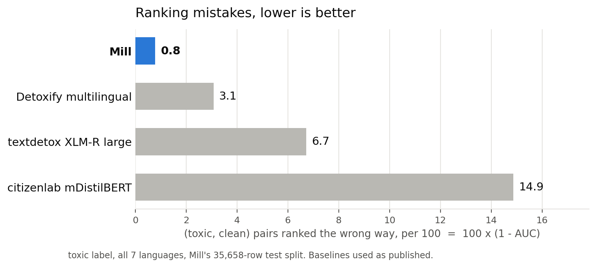

---
language:
  - en
  - ru
  - tr
  - es
  - fr
  - it
  - pt
license: apache-2.0
library_name: transformers
pipeline_tag: text-classification
base_model: xlm-roberta-large
tags:
  - toxicity
  - content-moderation
  - multilingual
  - multi-label
  - xlm-roberta
  - custom_code
metrics:
  - roc_auc
  - f1
model-index:
  - name: Mill (toxic-comment-multilingual-xlmr)
    results:
      - task:
          type: text-classification
          name: Multi-label toxicity classification
        dataset:
          type: custom
          name: Multilingual Jigsaw-derived toxicity corpus (7 languages)
          split: test
        metrics:
          - type: roc_auc
            name: Macro AUC-ROC
            value: 0.9852
          - type: f1
            name: Macro F1 (tuned thresholds)
            value: 0.8814
          - type: f1
            name: Macro F1 (threshold 0.5)
            value: 0.8821
---

> **Known bias: short benign self-descriptions that name an identity are flagged as toxic.**
>
> | Probe, one short sentence | P(toxic) |
> |---|---|
> | Sexual orientation, two probes | **0.891**, **0.668** |
> | Race | **0.612** |
> | LGBTQ identity | **0.531** |
> | Disability | **0.485** |
> | Control, gender only, two probes | 0.067, 0.038 |
>
> The `toxic` threshold is 0.472, so the first five fire and the controls do not. Benign
> identity probes are flagged at 0.41 (en) to 0.74 (pt); controls at 0.00 in all seven languages.
> On real held-out rows with no positive label, identity-term rows are flagged 2.84x as often
> (95% CI [1.96, 3.82]). One paragraph of neutral filler in front drops the top probe to 0.042.
> The cause is the training data: benign identity usage is almost absent from it. Do not run this
> on user content without mitigation or human review. [Analysis](https://github.com/Deeptanshuu/Toxic-Comment-Classification-using-Deep-Learning/blob/main/experiments/identity_bias.md).

# Mill (toxic-comment-multilingual-xlmr)

**Unstructured comment in, typed probabilistic decisions out.**

Six independent toxicity probabilities per comment, in one forward pass, for English, Russian,
Turkish, Spanish, French, Italian and Portuguese. XLM-RoBERTa-large plus one language-conditioned
attention block. Similar in idea to TypeSafe's
[Jev](https://typesafe.ai/blog/introducing-system-one-models-and-jev); not affiliated.

| Label | Index | Meaning |
|---|---|---|
| `toxic` | 0 | Rude or disrespectful |
| `severe_toxic` | 1 | Extreme `toxic` (a subset of it) |
| `obscene` | 2 | Obscene or vulgar |
| `threat` | 3 | Threat of violence |
| `insult` | 4 | Insulting toward a person |
| `identity_hate` | 5 | Hatred toward an identity group |

Labels are not exclusive: each has its own sigmoid and its own threshold.

## Quick start

```python
import json, torch
from huggingface_hub import hf_hub_download
from transformers import AutoModel, AutoTokenizer

REPO = "Deeptanshuu/toxic-comment-multilingual-xlmr"
LANGUAGE_IDS = {"en": 0, "ru": 1, "tr": 2, "es": 3, "fr": 4, "it": 5, "pt": 6}
LABELS = ["toxic", "severe_toxic", "obscene", "threat", "insult", "identity_hate"]

model = AutoModel.from_pretrained(REPO, trust_remote_code=True).eval()
tokenizer = AutoTokenizer.from_pretrained(REPO)
with open(hf_hub_download(REPO, "thresholds.json")) as f:
    thresholds = json.load(f)["thresholds"]
cut = torch.tensor([thresholds[name] for name in LABELS])

texts, langs = ["You are an absolute idiot.", "Sei un cretino, vattene via."], ["en", "it"]
enc = tokenizer(texts, padding=True, truncation=True, max_length=512, return_tensors="pt")
with torch.no_grad():
    probs = model(**enc, lang_ids=torch.tensor([LANGUAGE_IDS[l] for l in langs]))["probabilities"]

for text, row in zip(texts, probs):
    print(text, "->", [n for n, p, t in zip(LABELS, row, cut) if p >= t] or ["clean"])
```

`trust_remote_code` runs `modeling_toxic_xlmr.py` from this repo. To avoid it, download the repo
and call `load_model(path)` from that file. `inference_example.py` is a batched version.

**`lang_ids`** is one integer per row (table above). Leave it out and every row is scored as
English, with one warning; the ablation found no accuracy cost to that. Ids outside 0-6 are clamped.

**Thresholds:** do not use 0.5. `thresholds.json` has one per class (0.47 to 0.56), tuned on
validation. There are no per-language thresholds.

## Use

| Use it for | Do not use it for |
|---|---|
| Flagging comments for human review | Deleting, banning or penalising with no human check |
| Ranking a review backlog | Threat assessment or safety escalation |
| Research, and as a baseline | Languages outside the seven, long documents, spam, misinformation, self-harm |

Also expect: quoted abuse and counter-speech score like abuse; reclaimed slurs and in-group
speech are unmeasured; scores are ranks, not calibrated probabilities.

## Results

Held-out test split, 35,658 rows, thresholds tuned on validation only: macro AUC **0.9852**, macro
F1 **0.8814**, exact match **0.8772**.

Against public models, same test rows:

| Model | Size | `toxic` AUC | Comments/s | Latency |
|---|---|---|---|---|
| **Mill** | 565M | **0.9921** | 871 | 11.8 ms |
| Detoxify multilingual | 278M | 0.9692 | 2,424 | 6.2 ms |
| textdetox XLM-R large | 560M | 0.9327 | 896 | 11.0 ms |
| citizenlab mDistilBERT | 135M | 0.8513 | 3,700 | 2.9 ms |
| toxic-bert (English only) | 110M | 0.9797 (Mill 0.9797) | 1,362 | 5.5 ms |




Mill is the most accurate and runs at the speed of other XLM-R-large models, about a third of
Detoxify's throughput. One Quadro RTX 6000, fp16, median batch-1 latency. 89% of English test
rows are in Jigsaw data the Detoxify models trained on; removing them keeps every AUC gap. Mill
trained on this test set's distribution; the baselines did not.
[Details](https://github.com/Deeptanshuu/Toxic-Comment-Classification-using-Deep-Learning/blob/main/experiments/baselines.md).

Per class, tuned thresholds:

| Class | AUC | Threshold | Precision | Recall | F1 |
|---|---|---|---|---|---|
| `toxic` | 0.9921 | 0.4724 | 0.9534 | 0.9750 | 0.9641 |
| `severe_toxic` | 0.9863 | 0.4724 | 0.7139 | 0.8010 | 0.7549 |
| `obscene` | 0.9899 | 0.5276 | 0.9419 | 0.9338 | 0.9378 |
| `threat` | 0.9755 | 0.5276 | 0.8846 | 0.8003 | 0.8403 |
| `insult` | 0.9855 | 0.5643 | 0.9204 | 0.9266 | 0.9235 |
| `identity_hate` | 0.9818 | 0.5643 | 0.8959 | 0.8419 | 0.8680 |

Macro AUC by language: en 0.9902, ru 0.9790, tr 0.9726, es 0.9882, fr 0.9877, it 0.9893,
pt 0.9832. Full values in `metrics.json`.

### Compared with v1 (2025)

| Metric | Mill | v1 (2025) |
|---|---|---|
| Macro AUC | **0.9852** | 0.9147 |
| Macro F1, tuned thresholds | **0.8814** | 0.6036 |
| Weighted F1 | **0.9332** | 0.7732 |
| Exact match | **0.8772** | 0.6194 |


## On real traffic

The test set is about 50% toxic; real streams are 1-5%. Precision falls with the base rate:

| Label | Recall | FPR | Precision @ 50% | @ 5% | @ 1% |
|---|---|---|---|---|---|
| toxic | 0.975 | 0.0470 | 0.953 | 0.522 | **0.173** |
| insult | 0.927 | 0.0321 | 0.920 | 0.603 | 0.226 |
| obscene | 0.934 | 0.0184 | 0.942 | 0.728 | 0.339 |
| severe_toxic | 0.801 | 0.0156 | 0.714 | 0.730 | 0.342 |
| identity_hate | 0.842 | 0.0055 | 0.896 | 0.890 | 0.608 |
| threat | 0.800 | 0.0023 | 0.885 | 0.948 | **0.779** |

At 1% toxic, the `toxic` head flags about six comments per real one. Tune thresholds on your own
traffic if precision matters.

## Limitations

- Language conditioning is a measured null: +0.0003 macro AUC, 95% CI [-0.0007, +0.0012].
- The step that made the corpus multilingual is not in the source repo and cannot be audited.
- Rare classes are partly synthetic (Mistral-7B-Instruct-v0.3), labelled by prompt, not by people.
- Near-duplicates are 3.8% of English validation rows, so held-out numbers are slightly optimistic.
- `severe_toxic` is a subset of `toxic`; the independent sigmoids do not know that.
- Weights are a pickled state dict, not safetensors.

## Files

| File | Contents |
|---|---|
| `modeling_toxic_xlmr.py` | Model code, for `trust_remote_code` or `load_model()` |
| `config.json` | Architecture config with `auto_map` |
| `pytorch_model.bin` | Weights, about 2.2 GB |
| `thresholds.json` | Per-class thresholds |
| `metrics.json` | Evaluation results |
| `training_config.json` | Training configuration |
| `inference_example.py` | Batched prediction example |
| tokenizer files | Stock `xlm-roberta-large` tokenizer |

## License

Apache 2.0 for the weights and code here. The base model is MIT. The training data (Jigsaw,
Wikipedia talk pages, Mistral-generated text) keeps its own terms.

## Citation

```bibtex
@misc{mill_toxicity,
  author       = {Deeptanshu Lal},
  title        = {Mill: multilingual multi-label toxicity classification},
  year         = {2026},
  howpublished = {\url{https://huggingface.co/Deeptanshuu/toxic-comment-multilingual-xlmr}}
}
```
