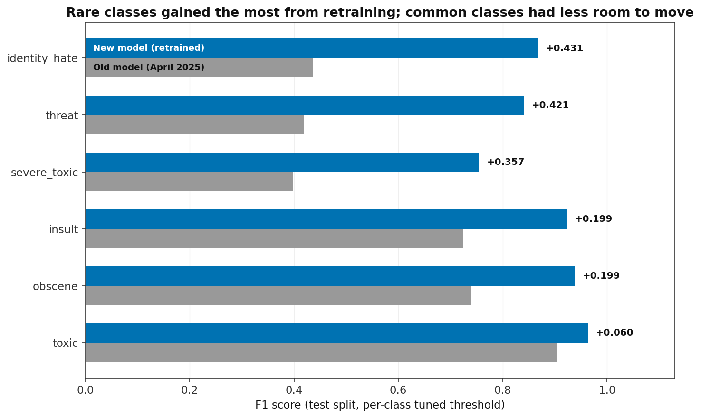
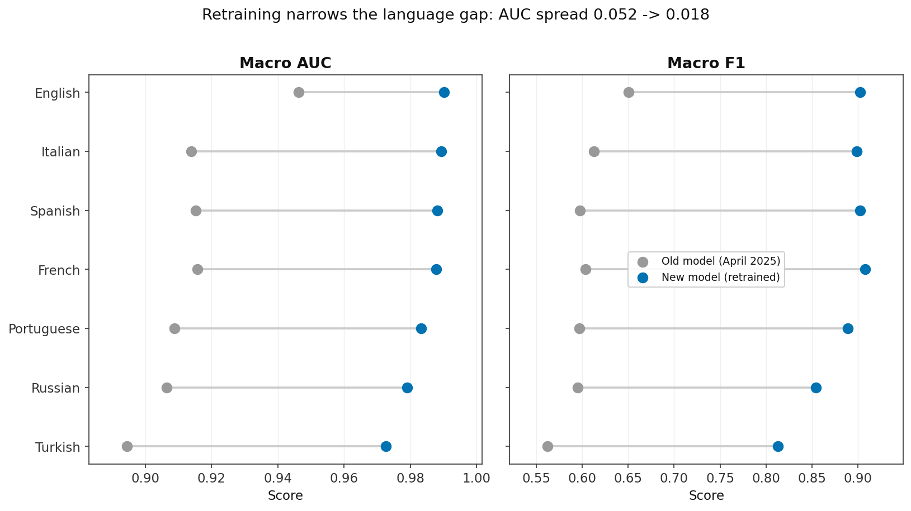
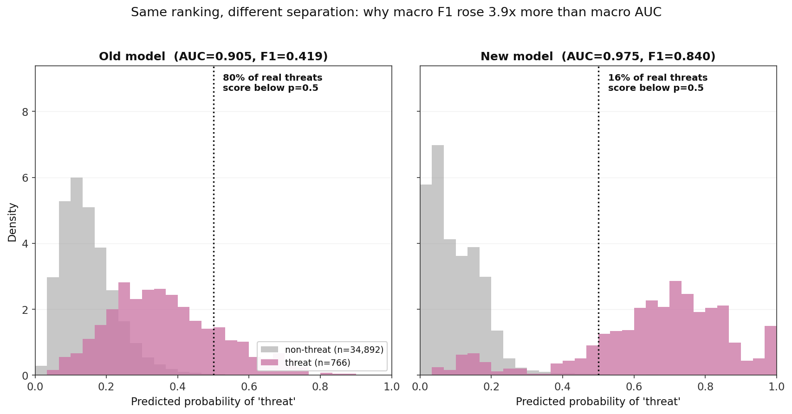

---
language:
  - en
  - ru
  - tr
  - es
  - fr
  - it
  - pt
license: apache-2.0
library_name: transformers
pipeline_tag: text-classification
base_model: xlm-roberta-large
tags:
  - toxicity
  - content-moderation
  - multilingual
  - multi-label
  - xlm-roberta
  - custom_code
metrics:
  - roc_auc
  - f1
model-index:
  - name: Mill (toxic-comment-multilingual-xlmr)
    results:
      - task:
          type: text-classification
          name: Multi-label toxicity classification
        dataset:
          type: custom
          name: Multilingual Jigsaw-derived toxicity corpus (7 languages)
          split: test
        metrics:
          - type: roc_auc
            name: Macro AUC-ROC
            value: 0.9852
          - type: f1
            name: Macro F1 (tuned thresholds)
            value: 0.8814
          - type: f1
            name: Macro F1 (threshold 0.5)
            value: 0.8821
---

> ## Known bias: identity terms are over-flagged
>
> Short, benign self-descriptions that contain an identity term are scored as toxic:
>
> | Input | P(toxic) | P(identity_hate) |
> |---|---|---|
> | "I am a gay man." | **0.891** | 0.336 |
> | "I am a lesbian." | **0.668** | 0.165 |
> | "I am a black man." | **0.612** | 0.554 |
> | "I am a queer person." | **0.531** | 0.075 |
> | "I am a deaf person." | **0.485** | 0.108 |
> | "I am a man." | 0.067 | 0.088 |
> | "I am a woman." | 0.038 | 0.087 |
>
> At the tuned `toxic` threshold of 0.472 the first five are flagged; the controls are not.
>
> - **Worse outside English.** False-positive rate on benign identity-term probes:
>   pt 0.741, ru 0.704, tr 0.667, es 0.667, fr 0.593, it 0.556, en **0.407**. Non-identity
>   controls score 0.000 in all seven languages.
> - **The trigger is short text.** One paragraph of neutral filler in front drops "I am a gay
>   man." from 0.891 to 0.042. Bios, chat lines and one-line replies are hit hardest.
> - **It shows up on real rows too.** Held-out test rows with no positive label are flagged at
>   0.120 if they contain an identity term, against 0.042 if not: **2.84x**, 95% CI [1.96, 3.82].
> - **Cause: the training data.** Of 726 English training rows containing "gay", 90.4% are
>   labelled toxic and none is a genuine benign self-description. Short "gay" comments are 94.6%
>   toxic, long ones 76.5%. The model learned that pattern faithfully.
>
> Used as-is, this model will disproportionately suppress LGBTQ people, and to a lesser extent
> racial and religious minorities, describing themselves. Do not run it on user content without
> mitigating this or reviewing flagged identity-term content by hand. Analysis and a costed fix:
> [experiments/identity_bias.md](https://github.com/Deeptanshuu/Toxic-Comment-Classification-using-Deep-Learning/blob/main/experiments/identity_bias.md).

# Mill (toxic-comment-multilingual-xlmr)

**A fast, single-pass model for toxicity: unstructured comment in, typed probabilistic decisions out.**

Multi-label toxicity classification in seven languages: English, Russian, Turkish, Spanish,
French, Italian, Portuguese. XLM-RoBERTa-large plus one attention block with a per-language bias
and a small head. One forward pass returns six independent probabilities.

The idea is similar to TypeSafe's
[Jev](https://typesafe.ai/blog/introducing-system-one-models-and-jev), applied to multilingual
toxicity moderation. Mill is independent and not affiliated with TypeSafe. Scores are ranks, not
calibrated probabilities, and latency has not been measured.

## Labels

| Label | Index | Meaning |
|---|---|---|
| `toxic` | 0 | Rude, disrespectful, or likely to make someone leave a discussion |
| `severe_toxic` | 1 | An extreme case of `toxic` (a subset of it in the source scheme) |
| `obscene` | 2 | Obscene or vulgar language |
| `threat` | 3 | A threat of violence against a person or group |
| `insult` | 4 | Insulting, inflammatory, or negative toward a person |
| `identity_hate` | 5 | Hatred toward an identity group: race, religion, gender, sexuality, nationality |

The labels are not exclusive, so each has its own sigmoid. Compare each score with its own
threshold and take every label that clears it.

## Quick start

Custom architecture: the model code ships as `modeling_toxic_xlmr.py` and needs
`trust_remote_code=True`.

```python
import json, torch
from huggingface_hub import hf_hub_download
from transformers import AutoModel, AutoTokenizer

REPO = "Deeptanshuu/toxic-comment-multilingual-xlmr"
LANGUAGE_IDS = {"en": 0, "ru": 1, "tr": 2, "es": 3, "fr": 4, "it": 5, "pt": 6}
LABELS = ["toxic", "severe_toxic", "obscene", "threat", "insult", "identity_hate"]

model = AutoModel.from_pretrained(REPO, trust_remote_code=True).eval()
tokenizer = AutoTokenizer.from_pretrained(REPO)

with open(hf_hub_download(REPO, "thresholds.json")) as f:
    thresholds = json.load(f)["thresholds"]
cut = torch.tensor([thresholds[name] for name in LABELS])

texts = ["You are an absolute idiot.", "Sei un cretino, vattene via."]
langs = ["en", "it"]

enc = tokenizer(texts, padding=True, truncation=True, max_length=512, return_tensors="pt")
lang_ids = torch.tensor([LANGUAGE_IDS[l] for l in langs])

with torch.no_grad():
    probs = model(
        input_ids=enc["input_ids"],
        attention_mask=enc["attention_mask"],
        lang_ids=lang_ids,
    )["probabilities"]

for text, row in zip(texts, probs):
    fired = [name for name, p, t in zip(LABELS, row, cut) if p >= t]
    print(text, "->", fired or ["clean"])
```

`inference_example.py` is the same as a runnable, batched script. To avoid remote code, download
the repo and call `load_model()` from `modeling_toxic_xlmr.py` directly:

```python
import sys
from huggingface_hub import snapshot_download

path = snapshot_download("Deeptanshuu/toxic-comment-multilingual-xlmr")
sys.path.insert(0, path)
from modeling_toxic_xlmr import load_model
model, tokenizer = load_model(path, device="cpu")
```

## `lang_ids`

The forward pass takes a third input, `lang_ids`: a `LongTensor` of shape `[batch_size]`.

| Language | en | ru | tr | es | fr | it | pt |
|---|---|---|---|---|---|---|---|
| `lang_id` | 0 | 1 | 2 | 3 | 4 | 5 | 6 |

- **Omitting it does not fail.** Every row is scored as English, with one `UserWarning` per
  process. The ablation found no measurable accuracy cost to this, but pass it when you know the
  language.
- The `text-classification` pipeline works but cannot pass `lang_ids` and applies no thresholds.
- Ids outside 0-6 are clamped with a warning. For other languages there is no right id: the model
  has never seen their labels.

## Thresholds

Do not use 0.5. `thresholds.json` holds one threshold per class, tuned for F1 on the validation
split (range 0.47 to 0.56). There are no per-language thresholds.

## Intended use

- Flagging comments for **human** review in a moderation queue.
- Prioritising a review backlog by likely severity.
- Research on multilingual toxicity, multi-label classification, or thresholding on imbalanced data.
- A baseline to beat.

## Out-of-scope use

**Not a sole automated decision-maker.** Do not delete, ban or penalise on this model's output
alone.

- Performance is uneven across languages (English 0.990 macro AUC, Turkish 0.973).
- Reclaimed slurs and in-group speech (AAVE, drag and queer in-group language) are a known failure
  mode for this class of model and have not been evaluated here.
- Quoted abuse and counter-speech score like first-person abuse.
- Not a threat-assessment process. Do not route safety-critical escalation through `threat`.
- Outputs are not calibrated. Treat them as ranks and use the thresholds.
- The evaluation data is about 50% toxic; real queues are a few percent. See
  [Real traffic](#what-this-looks-like-on-real-traffic).
- Not for other languages, long documents, misinformation, spam or self-harm content.

## Results

Held-out test split (35,658 rows); thresholds tuned on validation, never on test. Run
`evaluation_results/eval_20260830_072515`, `best_model` (epoch 5 of 6).

| Metric | This model | v1 (2025) |
|---|---|---|
| Macro AUC | **0.9852** | 0.9147 |
| Macro F1, tuned thresholds | **0.8814** | 0.6036 |
| Weighted F1 | **0.9332** | 0.7732 |
| Exact match | **0.8772** | 0.6194 |







Per class, test split, tuned thresholds:

| Class | AUC | Threshold | Precision | Recall | F1 |
|---|---|---|---|---|---|
| `toxic` | 0.9921 | 0.4724 | 0.9534 | 0.9750 | 0.9641 |
| `severe_toxic` | 0.9863 | 0.4724 | 0.7139 | 0.8010 | 0.7549 |
| `obscene` | 0.9899 | 0.5276 | 0.9419 | 0.9338 | 0.9378 |
| `threat` | 0.9755 | 0.5276 | 0.8846 | 0.8003 | 0.8403 |
| `insult` | 0.9855 | 0.5643 | 0.9204 | 0.9266 | 0.9235 |
| `identity_hate` | 0.9818 | 0.5643 | 0.8959 | 0.8419 | 0.8680 |

Macro AUC by language: English 0.9902, Russian 0.9790, Turkish 0.9726, Spanish 0.9882, French
0.9877, Italian 0.9893, Portuguese 0.9832. Weighted AUC 0.9890; macro F1 at 0.5 is 0.8821.
`metrics.json` has the same values.

### Against public models

`toxic` AUC on the same test rows. Each baseline used as published, no tuning.

| Model | Baseline AUC | Mill AUC | Mill lead [95% CI] |
|---|---|---|---|
| `unitary/multilingual-toxic-xlm-roberta` (Detoxify multilingual) | 0.9692 | 0.9921 | +0.023 [+0.021, +0.024] |
| `textdetox/xlmr-large-toxicity-classifier-v2` | 0.9327 | 0.9921 | +0.059 [+0.057, +0.062] |
| `citizenlab/distilbert-base-multilingual-cased-toxicity` | 0.8513 | 0.9921 | +0.141 [+0.137, +0.145] |
| `unitary/toxic-bert`, English only, six-label macro | 0.9584 | 0.9902 | +0.032 |

89% of English test rows also appear in Jigsaw data the Detoxify models trained on; removing every
overlapping row keeps or widens each gap. Mill was trained on this test set's distribution and
label definitions and the baselines were not, so part of the lead is home advantage. Details:
[experiments/baselines.md](https://github.com/Deeptanshuu/Toxic-Comment-Classification-using-Deep-Learning/blob/main/experiments/baselines.md).

## What this looks like on real traffic

The test corpus is about 50% toxic; real streams run 1-5%. Recall and false-positive rate do not
change with the mix, but precision does: `precision = TPR * p / (TPR * p + FPR * (1 - p))`, where
`p` is your toxic share.

| Label | Recall | FPR | Precision @ 50% | @ 5% | @ 1% |
|---|---|---|---|---|---|
| toxic | 0.975 | 0.0470 | 0.953 | 0.522 | **0.173** |
| insult | 0.927 | 0.0321 | 0.920 | 0.603 | 0.226 |
| obscene | 0.934 | 0.0184 | 0.942 | 0.728 | 0.339 |
| severe_toxic | 0.801 | 0.0156 | 0.714 | 0.730 | 0.342 |
| identity_hate | 0.842 | 0.0055 | 0.896 | 0.890 | 0.608 |
| threat | 0.800 | 0.0023 | 0.885 | 0.948 | **0.779** |

- On a 1%-toxic stream the `toxic` head flags about six comments per real one.
- `threat` and `identity_hate` hold up best at low prevalence, because their FPR is tiny.
- For precision on your traffic, tune thresholds on a sample of it. `thresholds.json` is a
  starting point.

## Known limitations

- **Language conditioning is a measured null result.** Against a control trained without it:
  +0.0003 macro AUC, 95% CI [-0.0007, +0.0012], p = 0.588, mixed sign across languages. The
  mechanism works; it just adds nothing here, so `lang_ids` can be omitted.
- **The multilingual corpus cannot be audited.** The step that turned Jigsaw's English data into
  seven languages is not in the source repo, so non-English label semantics are inherited from an
  unknown process.
- **Rare classes are partly synthetic.** `threat` was topped up with Mistral-7B-Instruct-v0.3
  output, labelled by the prompt, not by people, and filtered by a classifier trained on the same
  distribution.
- **Mild leakage.** Exact overlap between splits is zero, but near-duplicates make up 3.8% of
  English and 0.6% of Russian validation rows, so held-out numbers are slightly optimistic.
- **Fairness is only partly measured.** Identity-term bias is measured (above); reclaimed slurs
  and in-group language are not.
- `severe_toxic` is a subset of `toxic` by construction; independent sigmoids do not know that.
- Weights are a pickled `pytorch_model.bin` state dict, not safetensors.

## Files

| File | What it is |
|---|---|
| `modeling_toxic_xlmr.py` | Model definition, for `trust_remote_code=True` or `load_model()` |
| `config.json` | Architecture config, with the `auto_map` for the auto classes |
| `pytorch_model.bin` | Weights, raw state dict (about 2.2 GB) |
| `thresholds.json` | Per-class thresholds tuned on validation |
| `metrics.json` | Evaluation results |
| `training_config.json` | Exact training configuration |
| `inference_example.py` | Runnable batch prediction with thresholds |
| tokenizer files | Stock `xlm-roberta-large` tokenizer |

## License

Apache 2.0, covering the weights and code in this repo. The base model `xlm-roberta-large` is
MIT. The license does not extend to the training data: the Jigsaw and Wikipedia talk-page data and
the Mistral-7B-Instruct-v0.3 synthetic data carry their own terms.

## Citation

```bibtex
@misc{mill_toxicity,
  author       = {Deeptanshu Lal},
  title        = {Mill: multilingual multi-label toxicity classification},
  year         = {2026},
  howpublished = {\url{https://huggingface.co/Deeptanshuu/toxic-comment-multilingual-xlmr}}
}
```
