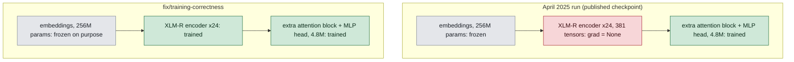

# Multilingual Toxic Comment Classification

Multi-label toxicity classification across 7 languages (en, ru, tr, es, fr, it, pt), built on
XLM-RoBERTa-large. Each comment gets 6 independent yes/no scores: `toxic`, `severe_toxic`,
`obscene`, `threat`, `insult`, `identity_hate`. "Multi-label" means the labels are not exclusive —
one comment can be `toxic` and `insult` and nothing else, or all six at once.

The design idea being tested is *language-conditioned attention*: the model is told which language
it is reading, and that signal is allowed to change how the attention layer weighs the tokens. The
hypothesis is that this beats plain XLM-R fine-tuning, which sees only the tokens.

## Status

The project was archived in 2025 as a learning exercise with 11 documented bugs. It has since been
audited and largely fixed on the `fix/training-correctness` branch. Three things you should know
before you read anything else here.

**1. The published model never fine-tuned its backbone.** This is the finding that reframes the
whole project, and nobody knew it until the audit. Fine-tuning means letting the weights of the
pretrained network change during training. That never happened. Of 565M parameters, 4.8M — **0.8%**
— actually received a gradient. All 381 weight tensors inside the XLM-RoBERTa encoder had
`grad = None`, meaning PyTorch never computed a derivative for them, so the optimizer had nothing
to update and they finished training bit-identical to how they started.

What was really trained is a *linear probe*: a small trainable head sitting on top of a frozen
feature extractor. The published 0.9147 macro AUC is a fair number for that, and a poor one for a
fine-tuned XLM-R-large.

**2. The language-aware attention was a no-op.** The language bias tensor had the wrong shape, and
because of a property of softmax it cancelled out exactly. `lang_ids` had literally no effect on
the output: feeding the same text with two different language IDs moved the logits by 3.6e-07,
which is float32 rounding noise. The fix, and the algebra behind why the repo's own proposed fix
was also wrong, is in [docs/MODEL.md](docs/MODEL.md#the-language-bias-and-why-the-shape-is-the-whole-bug).
The same two-language-ID test now moves the logits by 1.9e-01, five orders of magnitude more.

**3. The decisive experiment has not been run yet.** Language conditioning now demonstrably does
*something*. Whether that something *helps* is a separate question, answered only by training twice
— once with real `lang_ids`, once with the language pathway switched off — and comparing. That
ablation has not been run. Until it is, the project's central claim is testable but untested. If
the gap turns out to be zero, that is a real finding too, and a more useful one than an unverified
architecture.

### What actually received a gradient



Grey is frozen, green is training, and red is the failure: parameters that were meant to train and
silently did not. The April run updated 0.8% of the network; the current branch trains 307.1M
parameters, 54.4%. The embeddings stay frozen in both columns — that part was a good outcome
reached for a bad reason, and it is kept on purpose now. Why, and how a single default flag caused
the red box, is in [docs/MODEL.md](docs/MODEL.md#what-is-frozen-and-why).

### Numbers

The only trustworthy numbers today are the baseline: the old epoch-2 checkpoint, thresholds tuned
on `val` and reported on the held-out `test` split — macro AUC **0.9147**, macro F1 **0.5284** at a
0.5 threshold and **0.6036** at tuned thresholds. AUC measures how well the model *ranks* comments
(would a random positive score above a random negative?), F1 measures how well it *decides* once
you pick a cut-off. A model can rank well and decide badly, and this one does.

A full retrain on the fixed code is **currently running**, so there are no final numbers yet.
Per-class and per-language breakdowns, and the caveats that go with them, are in
[docs/RESULTS.md](docs/RESULTS.md). The audit trail — every bug, what it did, what is still open —
is in [docs/KNOWN_ISSUES.md](docs/KNOWN_ISSUES.md).

## Setup

Dependencies are managed with [uv](https://docs.astral.sh/uv/); `pyproject.toml` + `uv.lock` are
the source of truth.

```bash
uv sync --all-extras
```

Full details, including the extras (`serve`, `augment`, `analysis`) and how `requirements.txt` is
regenerated, are in [docs/DEVELOPMENT.md](docs/DEVELOPMENT.md).

Weights are not committed. The demo apps read `weights/toxic_classifier_xlm-roberta-large/`, which
holds the 2025 checkpoint; the current run writes to `weights/toxic_classifier_xlmr_v2/`, a separate
directory so the checkpoint rotation cannot delete the old one.

## Train and evaluate

```bash
uv run python -m model.train                    # config in model/training_config.py
scripts/train_tmux.sh                           # same, in tmux, with TensorBoard alongside

uv run python -m model.evaluation.evaluate \
    --model_path weights/toxic_classifier_xlmr_v2/best_model
```

Evaluation defaults are now correct — `--max_length 512` matching training, thresholds tuned on
`val` and reported on `test` — but `--model_path` still defaults to the 2025 checkpoint directory,
so pass it explicitly to score a new run. To run the control arm of the ablation:

```bash
TOXIC_DISABLE_LANG_CONDITIONING=1 uv run python -m model.train
```

That switch makes the model ignore `lang_ids` entirely
(`model/language_aware_transformer.py:252`). The run is tagged `run.kind=control` in MLflow so the
two arms can be compared from the run table.

## Monitor a run

| Tool | Command | URL | Shows |
|---|---|---|---|
| TensorBoard | `scripts/train_tmux.sh` starts it | `:6006` | per-step loss, LR, grad norm, GPU memory |
| Training dashboard | `scripts/monitor.sh` | `:8502` | live Streamlit view over the same event files |
| MLflow | `scripts/mlflow_ui.sh` | `:5000` | params, tags, artifacts, run-vs-run comparison |

TensorBoard and MLflow are written by the same call in the training loop
(`model/tracking.py`). Both fail independently and neither can take a run down — the April run died
at epoch 4 of 6 on a logging-backend auth error, which is exactly why the published checkpoint is a
half-trained epoch-2 model.

## Layout

```
model/          model definition, training loop, sampler, collator, tracking, inference, evaluation
dataset/        raw, processed and split CSVs (split/{train,val,test}.csv)
augmentation/   Mistral-7B synthetic generation for rare classes
analysis/       class weights, loss/ROC curves, language distribution
utils/          dataset build, split, dedup, leakage check, attention/attribution viz
scripts/        train_tmux.sh, monitor.sh, mlflow_ui.sh
docs/           the documents linked below
monitor_app.py  live training dashboard   ·   app.py  Gradio demo   ·   streamlit_app.py  demo
runs/, mlruns/  TensorBoard event files and the MLflow file store (both gitignored)
```

## Docs

| | |
|---|---|
| [Model and training](docs/MODEL.md) | Architecture, the language-bias mechanism, loss, freezing, schedule, config |
| [Known issues](docs/KNOWN_ISSUES.md) | The audited bugs, what each one did, and what is still open |
| [Results](docs/RESULTS.md) | Metrics per class and per language, with caveats |
| [Data](docs/DATA.md) | Provenance, augmentation, split hygiene and measured leakage |
| [Development](docs/DEVELOPMENT.md) | uv setup, extras, linting, running the demos |

## Acknowledgements

Base model: [XLM-RoBERTa](https://huggingface.co/xlm-roberta-large) (Conneau et al., 2020).
Label schema and English data: Jigsaw / Conversation AI Toxic Comment Classification.
Synthetic augmentation: Mistral-7B-Instruct-v0.3.
