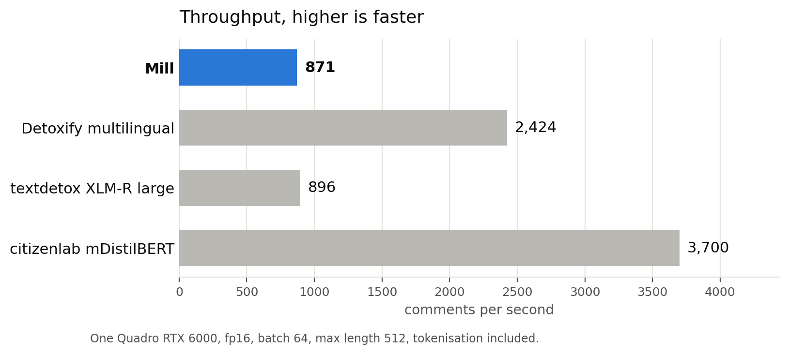
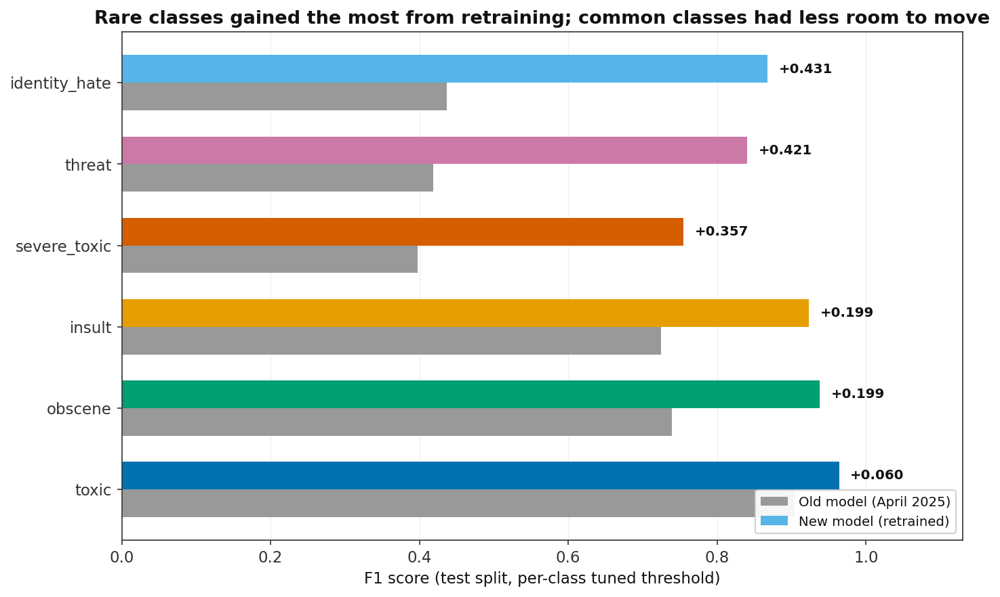
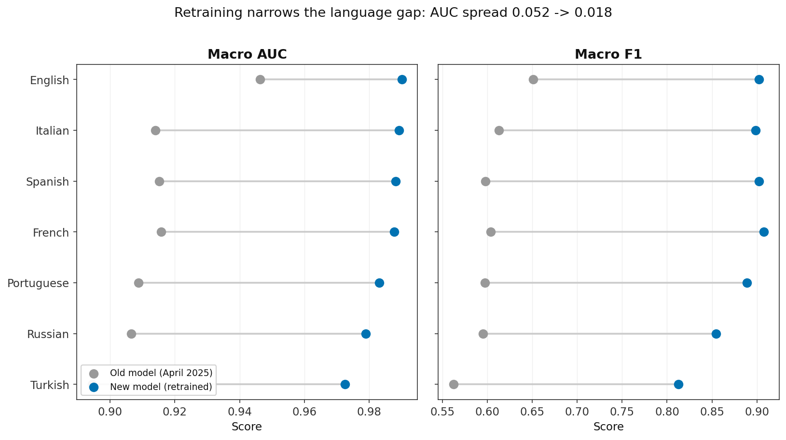
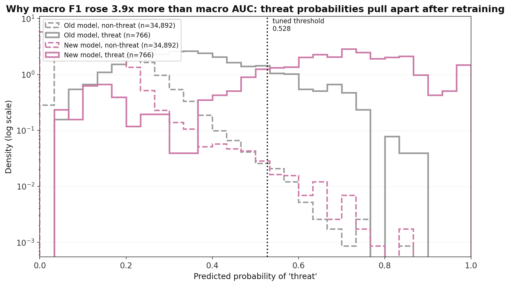

# Mill Screen

**A fast, single-pass model for multilingual toxicity.**

> Unstructured comment in, typed probabilistic decisions out.

Mill reads a comment once and returns 6 independent probabilities: `toxic`, `severe_toxic`,
`obscene`, `threat`, `insult`, `identity_hate`. The labels are not exclusive, so one comment can
carry several. It covers 7 languages (en, ru, tr, es, fr, it, pt) and is built on XLM-RoBERTa-large
with a language-conditioned attention block on top.

Mill is meant to be called as a function inside a software workflow, not used as a chat model. The
idea is similar to TypeSafe's [Jev](https://typesafe.ai/blog/introducing-system-one-models-and-jev),
applied here to toxicity moderation. Mill is an independent project and is not affiliated with
TypeSafe.

## Results

Held-out `test` split, per-class thresholds tuned on `val`: macro AUC **0.9852**, macro F1 **0.8814**.
Source: [docs/RESULTS.md](docs/RESULTS.md).

Against public models, same test rows, each baseline used as published. Source: [experiments/baselines.md](experiments/baselines.md).

| Model | Size | `toxic` AUC | Comments/s | Latency |
|---|---|---|---|---|
| **Mill** | 565M | **0.9921** | 871 | 11.8 ms |
| Detoxify multilingual | 278M | 0.9692 | 2,424 | 6.2 ms |
| textdetox XLM-R large | 560M | 0.9327 | 896 | 11.0 ms |
| citizenlab mDistilBERT | 135M | 0.8513 | 3,700 | 2.9 ms |
| toxic-bert (English only) | 110M | 0.9797 (Mill 0.9797) | 1,362 | 5.5 ms |




Mill is the most accurate, at the speed of other XLM-R-large models (a third of Detoxify's
throughput). 89% of English test rows are in Jigsaw data the Detoxify models trained on; removing
them keeps every gap. Mill trained on this test set's distribution; the baselines did not.

### Compared with v1 (2025)

| Metric | Mill (v2) | v1 (2025) | Delta |
|---|---|---|---|
| AUC (macro) | **0.9852** | 0.9147 | +0.0704 |
| F1 (macro) | **0.8814** | 0.6036 | +0.2778 |
| F1 (weighted) | **0.9332** | 0.7732 | +0.1600 |
| Exact match | **0.8772** | 0.6194 | +0.2578 |



The rare classes gained most: `identity_hate` and `threat` roughly doubled.



Every language improved, and the gap between best and worst narrowed from 0.052 to 0.018 AUC.



v2 separates real threats from everything else: 16% of threats score below 0.5, down from 80%.

**Known bias:** short benign self-descriptions that name an identity are over-flagged as toxic.
Read [experiments/identity_bias.md](experiments/identity_bias.md) before deploying.

## Setup

```bash
uv sync --all-extras
```

Weights are not committed. The model lives in `weights/toxic_classifier_xlmr_v2/best_model`.

## Train and evaluate

```bash
uv run python -m model.train                  # config: model/training_config.py
GPUS=1 scripts/train_tmux.sh                  # same, in tmux, with TensorBoard
uv run python -m model.evaluation.evaluate --model_path weights/toxic_classifier_xlmr_v2/best_model
```

Monitor a run with TensorBoard (`:6006`, started by `train_tmux.sh`) or `scripts/monitor.sh`
(`:8502`).

## Layout

```
model/          model, training loop, sampler, collator, tracking, inference, evaluation
dataset/        raw, processed and split CSVs
augmentation/   synthetic generation for rare classes
analysis/       class weights, curves, language distribution
utils/          dataset build, split, dedup, leakage check, visualisation
hf_release/     Hugging Face model card and loading code
app.py          Gradio demo   ·   streamlit_app.py  Streamlit demo   ·   monitor_app.py  training dashboard
```

## Docs

| Doc | Covers |
|---|---|
| [Model](docs/MODEL.md) | Architecture, language conditioning, loss, freezing, config |
| [Results](docs/RESULTS.md) | Per-class and per-language metrics, ablation |
| [Data](docs/DATA.md) | Provenance, augmentation, splits, leakage |
| [Development](docs/DEVELOPMENT.md) | Environment, monitoring, demos |
| [Known issues](docs/KNOWN_ISSUES.md) | Open issues and their history |

## Acknowledgements

Base model: [XLM-RoBERTa](https://huggingface.co/xlm-roberta-large) (Conneau et al., 2020).
Label schema and English data: Jigsaw / Conversation AI Toxic Comment Classification.
Synthetic augmentation: Mistral-7B-Instruct-v0.3.
